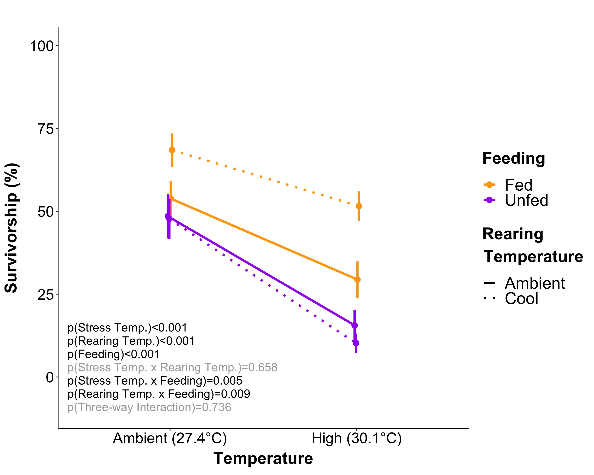

## Setup  

Set up workspace, set options, and load required packages.  
```{r, echo=TRUE, show=FALSE}
rm(list=ls(all=TRUE)) 
```

```{r setup, echo=TRUE}
knitr::opts_chunk$set(root.dir = "~/R",warning=FALSE, message=FALSE)
```

```{r, echo=FALSE, results=FALSE}
getwd()
```

```{r, echo=FALSE, results=FALSE, messages=FALSE}
library("reshape") #reshape data
library("plotrix") #functions in tapply
library("ggplot2") #plotting
library("reshape2") #reshape data
library("dplyr")  #splitting, applying, and combining data
library("plyr")  #splitting, applying, and combining data
library("pscl") 
library("plotrix") #plotting
library("gridExtra") #arrange plots for output
library("car") #levenes test
library("exactRankTests")
library("lsmeans")
library("vegan") #nmds
library("effects")
library("blmeco") #overdispersion tests
library("multcomp") 
library("multcompView")
library("vegan") #calculating distance matrices
library("survival") #Kaplan-Meier Survivorship Curves
library("survminer")  #Kaplan-Meier Survivorship Curves
library("betareg") #beta regressions
library("coin") #rank testing
library("mvtnorm")
library("PMCMR")
library("scales")
library("MuMIn")
library("glmmTMB")
library("lme4") #linear mixed modeling
library("lmerTest") #Adds p-value calculations to lme4 models
library("ggsignif") #add significance values to ggplots
library("HH") #post-hoc figures
library("MASS")
library("FSA")
library("emmeans") #post-hoc tests
library("cowplot") #plotting
library("magick") #plotting images with plots
library("tidyverse")
library("coxme") #add random effects to coxph model
library("factoextra")
library("ggfortify")
```

## Authors    

Author contributions: A Huffmyer designed study, conducted experiment, collected and analyzed data, and wrote manuscript. C Johnson conducted the experiment and collected data. A Epps collected and analyzed data. R Gates and J Lemus assisted with designing the study and provided laboratory space, resources, and funding.  

## Study Overview  

*Methodology overview*  

Juvenile corals were exposed to temperature treatment conditions for 30 days in Ambient and Cool treatments. Ambient conditions mimic average temperatures in June in Kaneoehe Bay during the timeframe in which this experiment was conducted. The Cool treatment conditions mimic average temperatures in March-April in Kaneohe Bay. All temperature treatments fluctuated 1.4°C daily. Within these treatments, juveniles were either supplied with fresh plankton from Kaneohe Bay or were not supplied with a heterotrophic food source. Three tanks were in each treatment: **Ambient-Heterotrophy (AH), Ambient-No Heterotrophy (AN), Cool-Heterotrophy (CH), and Cool-No Heterotrophy (CN)**. Tanks were 40L in volume and were equipped with a heater, pump, and Ecotech Marine LED aquarium lighting, peaking at ~250 PAR on a 12:12 light:dark cycle. Juveniles were settled and reared in these conditioning treatments for 30 days. Growth and survivorship was measured during the conditioning period. Over the course of the conditioning period, we measured performance (survivorship and growth) and ending physiological parameters (tissue thickness and symbiont fluorescnece).  

*See manuscript for detailed methodology and treatment summary information*  

## 1. Temperature Treatments  

### *Temperature on the natural reef*  

NOAA Moku o Loe station #51207, Pacific Islands Ocean Observing System  
Retrieved from: https://www.ndbc.noaa.gov/station_page.php?station=mokh1   

First, examine NOAA temperature data collected from the Moku o Loe station in March 2017 and June 2017 for comparison to treatment conditions during conditioning period. March provides a comparison to the "cool" treatment, while June offers a comparison to the "ambient" treatment.      
  
```{r, results=TRUE, message=FALSE, warning=FALSE}
noaaJune<-read.csv("Data/NOAA_June17.csv", header=T, na.strings="NA") #load data
noaaMarch<-read.csv("Data/NOAA_March17.csv", header=T, na.strings="NA") #load data 

noaaJune$DD<-as.factor(noaaJune$DD)
noaaMarch$DD<-as.factor(noaaMarch$DD)

TempsJune <- plyr::ddply(noaaJune, c("DD"), summarise,
                   Junemean = mean(WTMP, na.rm=TRUE),
                   Junesd   = sd(WTMP, na.rm=TRUE),
                   Junemin = min(WTMP, na.rm=TRUE),
                   Junemax = max(WTMP, na.rm=TRUE),
                   Junerange = Junemax-Junemin
                   )
TempsJune%>%
       summarise(Junemean_temp=mean(Junemean), Junemax_temp=max(Junemean), Junemin_temp=min(Junemean), Junemean_range=mean(Junerange), Junemax_range=max(Junerange), Junemin_range=min(Junerange), JuneSD=mean(Junesd))

TempsMarch <- plyr::ddply(noaaMarch, c("DD"), summarise,
                   Marchmean = mean(WTMP, na.rm=TRUE),
                   Marchsd   = sd(WTMP, na.rm=TRUE),
                   Marchmin = min(WTMP, na.rm=TRUE),
                   Marchmax = max(WTMP, na.rm=TRUE),
                   Marchrange = Marchmax-Marchmin
                   )
TempsMarch%>%
       summarise(Marchmean_temp=mean(Marchmean), Marchmax_temp=max(Marchmean), Marchmin_temp=min(Marchmean), Marchmean_range=mean(Marchrange), Marchmax_range=max(Marchrange), Marchmin_range=min(Marchrange), MarchSD=mean(Marchsd))
```

### *Experimental conditions*  

Load temperature data from Apex files and generate figure with: 

1. Time series of temperature data with mean treatment temperatures specified by color. 
2. Plot 24-hour cycle of temperatures by summarizing the mean temp at each time of day for during the conditioning period and the stress period. 

Temperature treatments were controlled using the Apex Neptune Aquacontroller platform in a 12-tank indoor controlled mesocosm system. Data are recorded in the Apex Aquacontroller system every 15 minutes and Apex temperature probes are calibrated every 3-7 days with a digital thermometer. Temperature data are loaded, summarized, and displayed in the figures below as a time series and 24-hour temperature cycles.  

Load temperature data from Apex files and generate figure with:

Plot 24-hour cycle of temperatures by summarizing the mean temp at each time of day for during the stress period. This includes only high temperature days, not ramping days.  

Display temperature means, standard deviation, and mean daily range for 1) each conditioning treatment; 2) each stress treatment; 3) assembled figure.  

```{r, results=TRUE}
physical<-read.csv("Data/Temperature.csv", header=T, na.strings="NA")
physical$DateTime <- as.POSIXct(physical$DateTime, format="%m/%d/%y %H:%M")

#subset temperature measurements
temps<-physical[complete.cases(physical$Temperature), ]

Temps1 <- ddply(temps, c("DateTime", "Treatment"), summarise,
                   N    = length(Temperature[!is.na(Temperature)]),
                   mean = mean(Temperature, na.rm=TRUE),
                   sd   = sd(Temperature, na.rm=TRUE),
                   se   = sd / sqrt(6), 
                   max = max(Temperature, na.rm=TRUE),
                   lower = mean-se, 
                   upper = mean+se
                   )

#set color palette
cols <- c("Ambient" = "#606060","Cool" = "#0099FF","High" = "#FF3333")

TimeSeries<-ggplot(Temps1, aes(x = DateTime, y = mean, fill=Treatment, color=Treatment)) + 
  geom_line(aes(color = Treatment), size = .5) +
  scale_color_manual(values = cols, breaks=c("Cool", "Ambient", "High")) +
  scale_fill_manual(values = cols, breaks=c("Cool", "Ambient", "High")) +
  ylab("Temperature (°C)")+
  xlab("Date")+
  geom_ribbon(aes(ymin=Temps1$lower, ymax=Temps1$upper), linetype=2, alpha=0.4, color=NA) +
  geom_vline(xintercept=as.numeric(Temps1$DateTime[6200]), linetype="dashed", 
                color = "black", size=0.75) +
  geom_vline(xintercept=as.numeric(Temps1$DateTime[12004]), linetype="dotted", 
                color = "black", size=0.75) +
  theme_classic()+
  theme(text = element_text(size = 18, color="black"))+
  theme(axis.title = element_text(size=16, color="black", face="bold")) +
  theme(axis.text.x = element_text())+
  theme(legend.title = element_text(face="bold"))+
  theme(plot.margin = unit(c(0.1, 0.1, 0.1, 0.1), "cm")) + #t, r, b, l
  theme(axis.title.y = element_text(margin = margin(t = 0, r = 5, b = 0, l = 0))) +
  theme(axis.title.x = element_text(margin = margin(t = 5, r = 0, b = 0, l = 0))) +
  theme(legend.position="top")+
  theme(axis.text = element_text(size=16, color="black"))

conditiontemps<-subset(temps, Phase=="Conditioning", c(DateTime, Day, Phase, Minutes, Tank, Temperature, Treatment))

Conditioning1 <- ddply(conditiontemps, c("Minutes", "Treatment"), summarise,
                   N    = length(Temperature[!is.na(Temperature)]),
                   mean = mean(Temperature, na.rm=TRUE),
                   sd   = sd(Temperature, na.rm=TRUE),
                   se   = sd / sqrt(6), 
                   max = max(Temperature, na.rm=TRUE),
                   min = min(Temperature, na.rm=TRUE), 
                   lower = mean-se, 
                   upper = mean+se
                   )

prestress_sum <- ddply(Conditioning1, c("Treatment"), summarise,
                    mean_temp = mean(mean, na.rm=TRUE), 
                    sd_temp   = mean(sd, na.rm=TRUE),
                    min_temp = min(mean),
                    max_temp = max(mean),
                    range_temp = (max_temp-min_temp)
                   );prestress_sum

ConditioningDay<-ggplot(Conditioning1, aes(x = Minutes, y = mean, color=Treatment, fill=Treatment)) + 
  geom_line(aes(color = Treatment), size = .5) +
  scale_color_manual(values = c("#606060", "#0099FF")) +
  scale_fill_manual(values = c("#606060", "#0099FF")) +
  theme_classic() +
  geom_ribbon(aes(ymin=Conditioning1$lower, ymax=Conditioning1$upper), linetype=2, alpha=0.4, color=NA) +
  ylab("Temperature (°C)")+
  scale_x_continuous(breaks=c(0, 720, 1440), labels=c("0:00", "12:00", "24:00")) +
  xlab("Time of Day") +
  ylim(24.5,31.5)+
  theme(legend.position="none")+
  theme(legend.title = element_text(face="bold"))+
  theme(text = element_text(size = 16, color="black"))+
  theme(plot.margin = unit(c(1, 0.1, 0.1, 1), "cm")) + #t, r, b, l
  theme(axis.title = element_text(size = 16, color="black", face="bold"))+
  theme(axis.title.y = element_text(margin = margin(t = 0, r = 5, b = 0, l = 0))) +
  theme(axis.title.x = element_text(margin = margin(t = 5, r = 0, b = 0, l = 0))) +
  theme(axis.text = element_text(size=16, color="black"))


stresstemps<-subset(temps, Phase=="Stress", c(DateTime, Day, Phase, Minutes, Tank, Temperature, Treatment))
substress1 <- filter(stresstemps, DateTime > as.POSIXct("2017-07-15 09:00:00"))
substress2 <- filter(substress1, DateTime < as.POSIXct("2017-07-20 10:00:00"))
substress3 <- filter(stresstemps, DateTime > as.POSIXct("2017-07-29 12:00:00"))
stresssubset<-bind_rows(substress1, substress2, substress3)

Stress1 <- ddply(stresssubset, c("Minutes", "Treatment"), summarise,
                   N    = length(Temperature[!is.na(Temperature)]),
                   mean = mean(Temperature, na.rm=TRUE),
                   sd   = sd(Temperature, na.rm=TRUE),
                   se   = sd / sqrt(6), 
                   max = max(Temperature, na.rm=TRUE),
                   lower = mean-se, 
                   upper = mean+se
                   )

stress_sum <- ddply(Stress1, c("Treatment"), summarise,
                    mean_temp = mean(mean, na.rm=TRUE), 
                    sd_temp   = mean(sd, na.rm=TRUE),
                    min_temp = min(mean),
                    max_temp = max(mean),
                    range_temp = (max_temp-min_temp)
                   );stress_sum

#subset to display high values, including both the first and second high temperature period, not ramping days

StressDay<-ggplot(Stress1, aes(x = Minutes, y = mean, color=Treatment, fill=Treatment)) + 
  geom_line(aes(color = Treatment), size = .5) +
  scale_color_manual(values = c("#606060", "#FF3333")) +
  scale_fill_manual(values = c("#606060", "#FF3333")) +
  theme_classic() +
  geom_ribbon(aes(ymin=Stress1$lower, ymax=Stress1$upper), linetype=2, alpha=0.4, color=NA) +
  ylab("Temperature (°C)")+
  xlab("Time of Day") +
  ylim(24.5,31.5)+
  scale_x_continuous(breaks=c(0, 720, 1440), labels=c("0:00", "12:00", "24:00")) +
  theme(legend.position="none")+
  theme(legend.title = element_text(face="bold"))+
  theme(text = element_text(size = 16, color="black"))+
  theme(axis.title = element_text(size = 16, color="black", face="bold"))+
  theme(plot.margin = unit(c(1, 0.1, 0.1, 1), "cm")) + #t, r, b, l
  theme(axis.title.y = element_text(margin = margin(t = 0, r = 5, b = 0, l = 0))) +
  theme(axis.title.x = element_text(margin = margin(t = 5, r = 0, b = 0, l = 0))) +
  theme(axis.text = element_text(size=16, color="black"))

right_row <- plot_grid(ConditioningDay, StressDay, labels = c('B', 'C'), nrow=2, ncol=1, label_size = 20)
tempplots<-plot_grid(TimeSeries, right_row, labels = c("A", ""), ncol=2, nrow=1, rel_widths = c(2.6, 1), label_size = 20)

#ggsave(filename="Figures/CondTemp.png", plot=ConditioningDay, dpi=300, width=8, height=8, units="in")

#ggsave(filename="Figures/StressTemp.png", plot=StressDay, dpi=300, width=8, height=8, units="in")

ggsave(filename="Figures/TemperatureFigure.pdf", plot=tempplots, dpi=300, width=13, height=6, units="in")
```

  

As the thermal stress profile occured in a dual-stress event due to an interruption in the experimental system, we calculate the number of total degree heating days accumlated by the end of the stress test.  

Degree heating days are calculated by finding the difference between the mean ambient treatment and the daily mean temperature in the high treatment for each day of the stress period. These degree heating day values are then added over the course of the stress test to provide a total degree heating day value.  

There were 62.14 Degree Heating Days in the high treatment as compared to the mean of the *ambient treatment* over the course of the 31-day stress period. Display mean and sd and mean range of temperature treatments during the stress period.  
```{r, results=TRUE}
#summarize temperature to generate means by day
DHD <- ddply(stresstemps, c("Day", "Treatment"), summarise,
                   mean = mean(Temperature, na.rm=TRUE),
                    sd = sd(Temperature, na.rm=TRUE),
                    min = min(Temperature, na.rm=TRUE), 
                    max = max(Temperature, na.rm=TRUE), 
                    range = max-min
                   )

#Obtain mean value for ambient over the course of the entire period
#ddply(stresstemps, c("Treatment"), summarise,
                   #mean = mean(Temperature, na.rm=TRUE)
                  # )
#Ambient mean over course of stress test is 27.40

#Generate new column to calculate difference between high temperature treatment each day and the average ambient temperature (27.40)
DHD<-subset(DHD, Treatment=="High", c(Day, Treatment, mean))
DHD$Diff<-DHD$mean-27.40

#sum these differences to calculate the total DHD value
sum(DHD$Diff)

#total DHD value is 62.14 Degree Heating Days as compared to mean of ambient treatment
```


## 2. Settlement

Settlement trials were conducted to measure settlement rate in Ambient and Cool temperature treatments to check assumption that starting juveniles were approximatley equal in each temperature. Settlement data is recorded as "Successes", which indicates the number of settlers after 24 hours, and "Failures", which indicates the number of swimming larvae that did not settle. Cohort indicates the day larvae were released from the parent colony. Settlement data are loaded and examined using binomial mixed models.  

```{r, restults=FALSE}
settle<-read.csv("Data/Larval_Settlement.csv", header=T, na.strings="NA")
settle$Cohort<-as.factor(settle$Cohort)
settle$Tank<-as.factor(settle$Tank)

#create binomial vector
attach(settle)
y<-cbind(Success, Failure)
```


Analyze effect of temperature treatment on settlement success with plug nested within tank and cohort as random effects. Cohort indicates day larvae were released over the 4-day collection period.  

`setmod<-glmer(y~Treatment + (1|Tank/Plug.ID) + (1|Cohort), family=binomial)`

Determine significance of treatment using Type III Anova analysis.  

```{r, results=TRUE}
#mixed model with tank and cohort as random effects
setmod<-glmer(y~Treatment + (1|Tank/Plug.ID) + (1|Cohort), family=binomial, REML=F)
Anova(setmod, type="II") #non sign at p=0.5719
```

Results indicate that temperature was not a significant driver of settlement at p=0.5691. Generate summary of model and check assumptions of residual normality.  

```{r, results=TRUE}
setmod<-glmer(y~Treatment + (1|Tank/Plug.ID) + (1|Cohort), family=binomial)
summary(setmod) 
qqPlot(residuals(setmod, type="deviance"))
```

Residuals appear normal. Check for overdispersion using the blmeco package: `dispersion_glmer(setmod)`    
```{r, results=TRUE}
dispersion_glmer(setmod)
```
Value is less than 1.008, which is less than the threshold considered acceptable (1.4) in the package description.   

There is no effect of treatment on settlement rates. Cohort will remain a random effect in future measurements as it produced variation in this model.   

Generate summary of settlement in each temperature treatment.  
```{r, results=TRUE}
settle$prop<-settle$Success/settle$Larvae

Settlement <- ddply(settle, c("Treatment"), summarise,
                   N    = length(prop[!is.na(prop)]),
                   mean = mean(prop, na.rm=TRUE),
                   sd   = sd(prop, na.rm=TRUE),
                   se   = sd / sqrt(N), 
                   max = max(prop, na.rm=TRUE)
)
knitr::kable(Settlement)
```

*Conclusions*  
1. Temperature did not influence settlement rate of larvae during 24-hour period in which settlement took place.   

2. We can assume settlement rate and therefore total settlement was likely equal across temperature treatments.  


## 3. Survivorship  

Survivorship was recorded weekly on all juvenile plugs in the experiment (n = ~715 plugs) as either 0 (at least one living spat) or 1 (no living spat) as required for Kaplan Meier analyses ("censor") across multiple timepoints during the 30-day treatment period. Data are examined as Kaplan-Meier survivorship curves and analyzed using Cox Proportional Hazards mixed models with temperature and nutrition as main effects and plug nested within tank and cohort as random effects.

```{r, results=FALSE}
#load data
KM<-read.csv("Data/PreStress_Survivorship.csv", header=TRUE, sep=",", na.strings="NA")

print(levels(KM$Temperature))  ##Levels are ambient, then cool - which is correct
print(levels(KM$Nutrition)) ##Needs to be reordered with No Heterotrophy first

KM$Nutrition <- relevel(KM$Nutrition, ref = "No Heterotrophy")
print(levels(KM$Nutrition))
```

 
Survivorship data is analyzed using a Cox Proportional Hazards model: `cox1<-coxph(Surv(Days,Censor)~Nutrition*Temperature, data=KM)`

```{r, results=TRUE}
#survivorship models
#temperature and nutrition as fixed effects
cox1<-coxph(Surv(Days,Censor)~Nutrition + Temperature + Nutrition:Temperature, data=KM)
```

Note that p values generated in this summary are not used as p values are calcuated with a Type II ANOVA. Tests show a significnat effect of temperature on survivorship with a coef of 0.82979 in the cool treatment, indicating that the risk of mortality is approx. 17% lower in cool temperature as compared to ambient.  

```{r, results=TRUE}
summary(cox1)
anova(cox1, type=2)
```

As there is no significant effect of nutritional treatment in the hazards model, we display the survivorship curves separated by Temperature and Nutritional treatment separately. The Kaplan-Meier curves show the separation in survivorship by temperature treatment and the lack of difference by nutritional treatment. Note that the difference in survivorship is small (approx 5%), but significant as indicated by model above. 

```{r, results=FALSE, fig.show="hide", results="hide"}
#Fit survivorship function for temperature
fitKM3 <- survfit(Surv(Days, Censor) ~ Temperature, type = "kaplan-meier", conf.type="log", data = KM)

#plot survivorship curves for temperature
survplotKM3<- ggsurvplot(fitKM3, conf.int=TRUE,  pval = FALSE, pval.size=8, test.for.trend = FALSE, main = "Bulk Plugs Survivorship", xlab = "Time (Days)", ylab = "Survival Probability", palette = c("#A0A0A0", "#0099FF"), title="", legend="top", legend.title=" ", surv.scale="percent", font.x=c(20,"bold"), font.tickslab=c(20), font.y=c(20,"bold"), font.title=c(20,"bold"), ylim=c(0,1), font.legend=c(20), font.axis=c(20), legend.lab=c("Ambient", "Cool"))

survplotKM3$plot <- survplotKM3$plot+ 
              ggplot2::annotate("text", 
                                x = 15, y = .35, # x and y coordinates of the text
                                label = "p(Temperature)<0.001", size = 7)

splots<-list()
splots[[1]]<-survplotKM3
surv1<-arrange_ggsurvplots(splots, print=TRUE, ncol=1, nrow=1)
#ggsave(filename="Figures/surv1.png", plot=surv1, dpi=300, width=8, height=8, units="in")
```

```{r, results=FALSE, fig.show="hide", results="hide"}
# fit survivorship function for nutrition
fitKM4 <- survfit(Surv(Days, Censor) ~ Nutrition, type = "kaplan-meier", conf.type="log", data = KM, na.action=na.omit)

#plot survivorship curves for nutrition
survplotKM4<- ggsurvplot(fitKM4, conf.int=TRUE,  pval = FALSE, pval.size=8, test.for.trend = FALSE, xlab = "Time (Days)", ylab = "Survival Probability", palette = c("orange", "purple"), title="", legend="top", legend.title=" ", surv.scale="percent", font.x=c(20,"bold"), font.tickslab=c(20), font.y=c(20,"bold"), font.title=c(20,"bold"), ylim=c(0,1), font.legend=c(20), font.axis=c(20), legend.lab=c("Heterotrophy", "No Heterotrophy"), margin=c(0.1,0.1,1,0.1))

survplotKM4$plot <- survplotKM4$plot+ 
              ggplot2::annotate("text", 
                                x = 15, y = .35, # x and y coordinates of the text
                                label = "p(Nutrition)=0.47", size = 7, color="darkgray")+
              ggplot2::annotate("text", 
                                x = 15, y = .25, # x and y coordinates of the text
                                label = "p(Nutrition x Temperature)=0.09", size = 7, color="darkgray")
survplotKM4

splots<-list()
splots[[1]]<-survplotKM4
surv2<-arrange_ggsurvplots(splots, print=TRUE, ncol=1, nrow=1)
#ggsave(filename="Figures/surv2.png", plot=surv2, dpi=300, width=8, height=8, units="in")
```

```{r, results=FALSE, fig.show="hide", results="hide"}
splots<-list()
splots[[1]]<-survplotKM3
splots[[2]]<-survplotKM4
survplotsALL<-arrange_ggsurvplots(splots, print=TRUE, ncol=2, nrow=1)
ggsave(filename="Figures/PreStressSurvivalFigure.png", plot=survplotsALL, dpi=300, width=13, height=8, units="in")

detach("package:survminer", unload=TRUE)
```

  

Summary of survivorship in table below for temperature treatments. 

```{r, results=TRUE}
SurvSummary2 <- ddply(KM, c("Days","Temperature", "Nutrition"), summarise,
                N    = length(Survivorship[!is.na(Survivorship)]),
                mean = mean(Survivorship, na.rm=TRUE),
                sd   = sd(Survivorship, na.rm=TRUE),
                se   = sd / sqrt(N)
)
knitr::kable(SurvSummary2)
```


*Conclusions*  
1. Survivorship was not different by nutritional treatment or the interaction of nutrition or temperature.  
2. Survivorship was significantly higher in the cool temperature treatment.  


## 4. Growth    

Growth data is collected as planar surface area of each juvenile at the start and end of the conditioning period (approx. 30 days).  

Data was collected and analyzed by C. Johnson and A. Epps from photographs taken of 10-15 plugs from each tank, taken with a scale bar for size reference. Data analyzed in ImageJ/Fiji software.  

Growth rate is calculated as the change in planar surface area normalized to starting size per day (% growth per day).

Here, data set is loaded and we remove any individuals with "NA" at the final timepoint due to mortality. As many individuals in this study either started as fused aggregates with other juveniles or fused with multiple other colonies during the conditioning period, fusion status will be incorporated as a random effect ("Fused.Final"). Data will be analyzed for both fused and non-fused juvenile colonies, as approximately 50% of dataset are fused individuals and should be included. Although not included here, future work should investigate growth, survivorship, and physiology of fused juvenile colonies.  

As growth is measured by photographs, this is the only dataset in which we can verify fusion status. Physiology data was collected on randomly selected plugs, which did not have photograph records from the start of the experiment.  

```{r, results=FALSE}
#load data
growth<-read.csv("Data/Colony_Growth.csv", header=TRUE, sep=",", na.strings="NA")
growth$Tank<-as.factor(growth$Tank)
growth$Colony.ID<-as.factor(growth$Colony.ID)
growth$Cohort<-as.factor(growth$Cohort)

print(levels(growth$Temperature))  ##Levels are ambient, then cool - which is correct
print(levels(growth$Nutrition)) ##Needs to be reordered with No Heterotrophy first

##reorder the levels
growth$Nutrition <- relevel(growth$Nutrition, ref = "No Heterotrophy")
print(levels(growth$Nutrition))

#check for incomplete rows
r<-which(is.na(growth$Area.Final), arr.ind=TRUE)
growth <- growth[-r, ]
```

First, calculate % growth per day in planar surface area for each juvenile examine for normality.   

```{r, results=FALSE}
growth$Planar<-((growth$Area.Final-growth$Area.Initial)/growth$Area.Initial)/(growth$Days)
qqPlot(growth$Planar)
```

Data is non-normally distributed, so we conduct a transformation. A quarter root transformation assists in meeting normality assumptions. Check normality of model residuals below during analysis below.    

```{r, results=TRUE}
growth$tPlanar<-(growth$Planar)^(1/4)
qqPlot(growth$tPlanar)
```

Growth rate is analyzed using lmer mixed effects model.  
Fixed Effects: Nutrition and temperature  
Random Effects: Tank, cohort, fusion status  

Significance determined using Type II ANOVA function.  

`modelGrowth=lmer(tPlanar~Nutrition * Temperature + (1|Fusion) + (1|Tank) + (1|Cohort), data=growth)`

Check for homogeneity of variance using the Levene's test (passes) in the car package and normality of residuals. Residuals appear to be normal, but with some very slight deviance at tails of qqplot.    

```{r, results=TRUE}
modelGrowth=lmer(tPlanar~Nutrition + Temperature + Nutrition:Temperature + (1|Fused.Initial) + (1|Tank/Plug.ID) + (1|Cohort), data=growth)
leveneTest(growth$tPlanar~growth$Nutrition*growth$Temperature)
qqPlot(residuals(modelGrowth))
```

Display summary of model and anova table for use of p-values.  

```{r, results=TRUE}
summary(modelGrowth)
anova(modelGrowth, type=2)
```

Perform Tukey post hoc analysis using emmeans function in the emmeans package.  
```{r, results=TRUE}
emm = emmeans(modelGrowth, ~ Temperature * Nutrition, adjust="tukey")
#letter display
cld(emm)
```

Generate a plot of non-transformed data to view growth rate between treatment groups. First, generate a summary table of proportion growth per day for each treatment.  

```{r, results=TRUE}
#multiply by 100 to obtain percentages for display
growth$graph<-growth$Planar*100

GrowthPlanar <- ddply(growth, c("Nutrition", "Temperature"), summarise,
                   N    = length(graph[!is.na(graph)]),
                   mean = mean(graph, na.rm=TRUE),
                   sd   = sd(graph, na.rm=TRUE),
                   se   = sd / sqrt(N), 
                   max = max(graph, na.rm=TRUE)
)
knitr::kable(GrowthPlanar)
```


```{r, results=TRUE}
Growth1a<-ggplot(data=GrowthPlanar, aes(x=Temperature, y=mean, colour=Nutrition)) +
  scale_colour_manual(values=c("purple", "orange"))+
  geom_line(position=position_dodge(0.03), size=1.3, aes(group=Nutrition)) +
  geom_point(size=3, position=position_dodge(0.03)) +
  geom_errorbar(aes(ymin=mean-se, ymax=mean+se), width=0, linetype="solid", position=position_dodge(0.03), size=1.3) +
  theme_classic()+
  theme(text = element_text(size = 18, color="black"))+
  theme(axis.text = element_text(size = 18, color="black"))+
  theme(legend.position = "none")+
  theme(axis.title = element_text(size = 18, color="black", face="bold"))+
  ylab(expression(bold(paste("% Planar Extension", " Day" ^-1)))) +
  theme(legend.title=element_blank())+
  theme(legend.text = element_text(size=18))+
  theme(plot.margin=unit(c(1.5,0,0,0), "cm"))+
  ylim(0,5)+
  scale_x_discrete(limits=c("Cool", "Ambient"))+
  theme(axis.title.y = element_text(margin = margin(t = 0, r = 7, b = 0, l = 1))) +
  theme(axis.title.x = element_text(margin = margin(t = 7, r = 0, b = 0, l = 0))) +
  xlab("Temperature") +
  geom_text(x=1.5, y=0.9, label="p(Nutrition)=0.003", size=6, color="black") + 
  geom_text(x=1.5, y=0.6, label="p(Temperature)=0.35", size=6, color="darkgray") + 
  geom_text(x=1.5, y=0.3, label="p(Interaction)=0.59", size=6, color="darkgray")

growthfig<-plot_grid(Growth1a, labels = c(""), ncol=1, nrow=1, rel_heights= c(1), rel_widths = c(1), label_size = 20, label_y=1, align="h")

ggsave("Figures/Growth_Figure.pdf", plot=growthfig, height=8, width=10, units = c("in"), dpi=500) #output figure
```

 

```{r, results=FALSE}
#bar plot
Growth1b<-ggplot(data=GrowthPlanar, aes(x=Temperature, y=mean, fill=Nutrition)) +
  scale_fill_manual(values=c("purple", "orange"))+
  geom_bar(stat="identity", position=position_dodge(), color="black")+
  geom_errorbar(aes(ymin=mean-se, ymax=mean+se),
                width=0.05, size=0.7, position=position_dodge(0.9))+
  theme_classic()+
  theme(text = element_text(size = 24, color="black"))+
  theme(axis.text = element_text(size = 24, color="black"))+
  theme(legend.position = "right")+
  theme(axis.title = element_text(size = 24, color="black", face="bold"))+
  ylab(expression(bold(paste("% planar extension", " day" ^-1)))) +
  theme(legend.title=element_blank())+
  theme(legend.text = element_text(size=24))+
  theme(plot.margin=unit(c(1.5,0,0,0), "cm"))+
  ylim(0,5)+
  scale_x_discrete(limits=c("Cool", "Ambient"))+
  theme(axis.title.y = element_text(margin = margin(t = 0, r = 7, b = 0, l = 1))) +
  theme(axis.title.x = element_text(margin = margin(t = 8, r = 0, b = 0, l = 0))) +
  xlab("Temperature") +
  geom_text(x=1.5, y=4.9, label="p(Nutrition)=0.003", size=6, color="black") + 
  geom_text(x=1.5, y=4.6, label="p(Temperature)=0.35", size=6, color="darkgray") + 
  geom_text(x=1.5, y=4.3, label="p(Interaction)=0.59", size=6, color="darkgray")

growthfig<-plot_grid(Growth1b, labels = c(""), ncol=1, nrow=1, rel_heights= c(1), rel_widths = c(1), label_size = 20, label_y=1, align="h")
```

 
```{r, results=FALSE}
#dot plot

Growth3<-ggplot(data=growth, aes(x=Temperature, y=graph, fill=Nutrition)) +
  scale_fill_manual(values=c("purple", "orange"))+
  geom_boxplot(width=0.75, position=position_dodge(0.9))+
  geom_dotplot(binaxis='y', stackdir='center', 
               position=position_dodge(0.9), dotsize=0.3, color="black")+
  theme_classic()+
  theme(text = element_text(size = 24, color="black"))+
  theme(axis.text = element_text(size = 24, color="black"))+
  theme(legend.position = "right")+
  theme(axis.title = element_text(size = 24, color="black", face="bold"))+
  ylab(expression(bold(paste("% planar extension", " day" ^-1)))) +
  theme(legend.title=element_blank())+
  theme(legend.text = element_text(size=24))+
  theme(plot.margin=unit(c(1.5,0,0,0), "cm"))+
  ylim(0,35)+
  theme(axis.title.y = element_text(margin = margin(t = 0, r = 7, b = 0, l = 1))) +
  theme(axis.title.x = element_text(margin = margin(t = 8, r = 0, b = 0, l = 0))) +
  xlab(expression(bold(paste("Temperature"))))

```

```{r, results=FALSE}
#multiply by 100 to obtain percentages for display
growth$graph<-growth$Planar*100

GrowthQtPlanar <- ddply(growth, c("Nutrition", "Temperature"), summarise,
                   N    = length(tPlanar[!is.na(tPlanar)]),
                   mean = mean(tPlanar, na.rm=TRUE),
                   sd   = sd(tPlanar, na.rm=TRUE),
                   se   = sd / sqrt(N), 
                   max = max(tPlanar, na.rm=TRUE)
)
knitr::kable(GrowthQtPlanar)
```

```{r, results=FALSE}
#dot plot
Growth3QT<-ggplot(data=growth, aes(x=Temperature, y=tPlanar, fill=Nutrition)) +
  scale_fill_manual(values=c("purple", "orange"))+
  geom_boxplot(width=0.75, position=position_dodge(0.9))+
  geom_dotplot(binaxis='y', stackdir='center', 
               position=position_dodge(0.9), dotsize=0.3, color="black")+
  theme_classic()+
  theme(text = element_text(size = 24, color="black"))+
  theme(axis.text = element_text(size = 24, color="black"))+
  theme(legend.position = "right")+
  theme(axis.title = element_text(size = 24, color="black", face="bold"))+
  ylab(expression(bold(paste("(planar extension", " day"^-1,")"^(1/4))))) + 
  theme(legend.title=element_blank())+
  theme(legend.text = element_text(size=24))+
  theme(plot.margin=unit(c(1.5,0,0,0), "cm"))+
  scale_x_discrete(limits=c("Cool", "Ambient"))+
  ylim(0,1)+
  theme(axis.title.y = element_text(margin = margin(t = 0, r = 7, b = 0, l = 1))) +
  theme(axis.title.x = element_text(margin = margin(t = 8, r = 0, b = 0, l = 0))) +
  xlab("Temperature");Growth3QT

```

*Conclusions*  
1. Growth was significantly higher in heterotrophic feeding treatment. There was no effect of temperature.  

## 5. Confocal Data Manipulation  

Tissue thickness and symbiont densities are measured using Laser Scanning Confocal Microscopy as described in Huffmyer et al. (2020).  

Raw data sets are inputted and manipulated to calculate the following based on:   
(1) Average Channel 2 (Red) symbiont intensity per spat sample  
(2) Average Channel 1 (Green) tissue thickness per spat sample    

```{r, results=FALSE}
#load data set for fluorescence (symbionts)
fluorescence<-read.csv("Data/Symbiont_Fluorescence.csv", header=TRUE, sep=",", na.strings="NA")

#load data set for tissue thickness 
zstack<-read.csv("Data/Tissue_Thickness.csv", header=TRUE, sep=",", na.strings="NA")

#load data set for colony area
area<-read.csv("Data/Colony_Area.csv", header=TRUE, sep=",", na.strings="NA")

#calculate average intensity values for symbionts
glow <- aggregate(fluorescence$Symbiont.Intensity, by=list(fluorescence$Sample, fluorescence$Tissue), FUN=mean)
glow <- rename(glow, c("Group.1"="Sample", "Group.2"="Tissue","x"="Symbiont.Intensity"))

#calculate average tissue intensity values and merge into glow datasheet
glow2 <- aggregate(fluorescence$Tissue.Intensity, by=list(fluorescence$Sample, fluorescence$Tissue), FUN=mean)
glow2 <- rename(glow2, c("Group.1"="Sample", "Group.2"="Tissue","x"="Tissue.Intensity"))

#calculate a colony mean value for symbionts and add into dataset
meanglow<-aggregate(glow$Symbiont.Intensity, by=list(glow$Sample), FUN=mean)
meanglow<-rename(meanglow, c("Group.1"="Sample", "x"="Symbiont.Intensity"))
meanglow$Tissue<-c("Colony")
meanglow$Tissue<-as.factor(meanglow$Tissue)

meanglow2<-aggregate(glow2$Tissue.Intensity, by=list(glow2$Sample), FUN=mean)
meanglow2<-rename(meanglow2, c("Group.1"="Sample", "x"="Tissue.Intensity"))
meanglow2$Tissue<-c("Colony")
meanglow2$Tissue<-as.factor(meanglow2$Tissue)

glow<-rbind.fill(glow, meanglow)
glow2<-rbind.fill(glow2, meanglow2)

#merge together
glow$Tissue.Intensity<-glow2$Tissue.Intensity

#remove incomplete rows
glow<-glow[complete.cases(glow), ]

#summarize average values for tissue thickness 
thickness <- aggregate(zstack$Thickness, by=list(zstack$Sample, zstack$Tissue), FUN=mean)
thickness <-rename(thickness, c("Group.1"="Sample", "Group.2"="Tissue","x"="Thickness"))

#calculate a colony mean value for thickness and add into datasheet
meanz<-aggregate(thickness$Thickness, by=list(thickness$Sample), FUN=mean)
meanz<-rename(meanz, c("Group.1"="Sample", "x"="Thickness"))
meanz$Tissue<-c("Colony")
meanz$Tissue<-as.factor(meanz$Tissue)

thickness<-rbind.fill(thickness, meanz)
#remove incomplete rows
thickness<-thickness[complete.cases(thickness), ]
```

Datasheets are assembled into a master data frame for analysis and includes all identifying information.  

```{r, results=FALSE}

#match thickness and glow by sample and tissue 
#create identifier column
thickness$ID<-paste(thickness$Sample, thickness$Tissue)
glow$ID<-paste(glow$Sample, glow$Tissue)

#merge values into one spreadsheet

thickness$Symbiont.Intensity<-glow$Symbiont.Intensity[match(thickness$ID, glow$ID)]
thickness$Tissue.Intensity<-glow$Tissue.Intensity[match(thickness$ID, glow$ID)]
thickness$Plug<-zstack$Plug[match(thickness$Sample, zstack$Sample)]
thickness$Spat<-zstack$Spat[match(thickness$Sample, zstack$Sample)]
thickness$Polyps<-zstack$Polyps[match(thickness$Sample, zstack$Sample)]
thickness$Cohort<-zstack$Cohort[match(thickness$Sample, zstack$Sample)]
thickness$Temperature<-zstack$Temperature[match(thickness$Sample, zstack$Sample)]
thickness$Nutrition<-zstack$Nutrition[match(thickness$Sample, zstack$Sample)]
thickness$Treatment<-zstack$Treatment[match(thickness$Sample, zstack$Sample)]
thickness$Tank<-zstack$Tank[match(thickness$Sample, zstack$Sample)]

#merge in area for each spat
thickness$Area<-area$Area[match(thickness$Sample, area$Sample)]

#call new data frame by new name and change cohort and tank to factors
confocal<-thickness
confocal$Cohort<-as.factor(confocal$Cohort)
confocal$Tank<-as.factor(confocal$Tank)
```

**Calibrate LSCM fluorescence values as described in Huffmyer et al. in prep:**  

LSCM collects symbiont cell density data as the intensity of "red" chlorophyll fluorescence as specified in LSCM settings. This value can be calibrated to a % Relative Intensity value, by using the Red InSpeck fluorescent microbead kits.  

Calibration equation for juvenile *P. acuta*: (Red Intensity Value + 79.395) / 24.301  

Here we also calculate the ratio of red:green fluorescence (symbiont:host) for exploration and analysis below.   

```{r, results=FALSE}
confocal$Red<-(confocal$Symbiont.Intensity+79.395)/24.301
confocal$Ratio<-(confocal$Symbiont.Intensity/confocal$Tissue.Intensity)
confocal$Green<-(confocal$Tissue.Intensity-38.045)/257.71

#remove individual colony with outlier surface area of 22 (about 10 higher than all others)
q <- with(confocal, which(Area>20, arr.ind=TRUE))
confocal <- confocal[-q, ]

#export master data frame
write.csv(confocal, file="Output/Master_Confocal.csv")
```

Create subsets of data by tissue type, as these will be analyzed separately.  

```{r, results=FALSE}
colony<-subset(confocal, Tissue=="Colony", select=c(Sample, Tissue, Thickness, ID, Symbiont.Intensity, Tissue.Intensity, Plug, Spat, Cohort, Temperature, Nutrition, Treatment, Tank, Area, Red, Green, Ratio))
polyp<-subset(confocal, Tissue=="Polyp", select=c(Sample, Tissue, Thickness, ID, Symbiont.Intensity, Tissue.Intensity, Plug, Spat, Cohort, Temperature, Nutrition, Treatment, Tank, Area, Red, Green, Ratio))
connecting<-subset(confocal, Tissue=="Connecting", select=c(Sample, Tissue, Thickness, ID, Symbiont.Intensity, Tissue.Intensity, Plug, Spat, Cohort, Temperature, Nutrition, Treatment, Tank, Area, Red, Green, Ratio))

#create data frame for all characteristics
colony$PolypThickness<-polyp$Thickness[match(colony$Sample, polyp$Sample)]
colony$PolypRed<-polyp$Red[match(colony$Sample, polyp$Sample)]
colony$ConnectThickness<-connecting$Thickness[match(colony$Sample, polyp$Sample)]
colony$ConnectRed<-connecting$Red[match(colony$Sample, polyp$Sample)]
```


## 6. Confocal Tissue Thickness 

Using the "Master_Confocal" data frame and tissue subsets, we first analyze tissue thickness measured by confocal LSCM.   

```{r, results=FALSE}
print(levels(colony$Temperature))  ##Levels are ambient, then cool - which is correct
print(levels(colony$Nutrition)) ##Needs to be reordered with No Heterotrophy first

##reorder the levels
colony$Nutrition <- relevel(colony$Nutrition, ref = "No Heterotrophy")
print(levels(colony$Nutrition))
```

**Examine Data for Normality** 

*Colony Level*
```{r, results=TRUE}
qqPlot(colony$Thickness)
```

Thickness data is normal at the colony level.   

**Analysis of Tissue Thickness**   

As data is continuous and normally distributed, we will analyze the data with lmer() as a linear mixed effects model.  

Temperature and Nutrition are main effects. Cohort and plug nested within tank as random effects as multiple individuals were measured on the same plug. Area is incorporated as a random effect to account for differences in colony size.   

`thickModel<-lmer(Thickness~Temperature+Nutrition+Temperature:Nutrition + (1+Area|Plug) + (1|Cohort) + (1|Tank/Plug), data=colony)`  

View summary of model and anova table for use of p-values.  
```{r, results=TRUE}
thickModel<-lmer(Thickness~Temperature + Nutrition + Temperature:Nutrition + (1+Area|Plug) + (1|Cohort) + (1|Tank/Plug), data=colony)
summary(thickModel)
anova(thickModel, type=2)
```

Check homogeneity of variances assumption with Levene's Test - passes. Check for normality of residuals - passes.  
```{r, results=TRUE}
leveneTest(colony$Thickness~colony$Nutrition*colony$Temperature)
qqPlot(residuals(thickModel))
```

Conduct post-hoc anaysis of tissue thickness data.  
```{r, results=TRUE}
emm = emmeans(thickModel, ~ Temperature * Nutrition, adjust="tukey")
#letter display
cld(emm)
```

Summarize tissue thickness in a table and plot.  

```{r, results=TRUE}
ThickTable <- ddply(colony, c("Nutrition", "Temperature"), summarise,
                   N    = length(Thickness[!is.na(Thickness)]),
                   mean = mean(Thickness, na.rm=TRUE),
                   sd   = sd(Thickness, na.rm=TRUE),
                   se   = sd / sqrt(N), 
                   max = max(Thickness, na.rm=TRUE)
)
knitr::kable(ThickTable)
```

View interaction plot.    
```{r, results=TRUE}
Thick2<-ggplot(data=ThickTable, aes(x=Temperature, y=mean, colour=Nutrition)) +
  scale_colour_manual(values=c("purple", "orange"))+
  geom_line(position=position_dodge(0.03), size=1.3, aes(group=Nutrition)) +
  geom_point(size=3, position=position_dodge(0.03)) +
  geom_errorbar(aes(ymin=mean-se, ymax=mean+se), width=0, linetype="solid", position=position_dodge(0.03), size=1.3) +
  theme_classic()+
  theme(text = element_text(size = 18, color="black"))+
  theme(axis.text.x = element_text(size = 18, color="black"))+
  theme(axis.text = element_text(size = 18, color="black"))+
  theme(legend.position = "none")+
  theme(axis.title = element_text(size = 18, color="black", face="bold"))+
  ylab(expression(bold(paste("Tissue Thickness (", mu, "m)")))) +
  theme(legend.title=element_blank())+
  theme(legend.text = element_text(size=18))+
  theme(plot.margin=unit(c(1.5,0,0,0), "cm"))+
  ylim(300,850) +
  theme(axis.title.y = element_text(margin = margin(t = 0, r = 7, b = 0, l = 1))) +
  theme(axis.title.x = element_text(margin = margin(t = 8, r = 0, b = 0, l = 0))) +
  xlab("Temperature") +
  scale_x_discrete(limits=c("Cool", "Ambient"))+
  geom_text(x=1.5, y=410, label="p(Nutrition)<0.001", size=6, color="black") + 
  geom_text(x=1.5, y=375, label="p(Temperature)=0.06", size=6, color="darkgray") + 
  geom_text(x=1.5, y=340, label="p(Interaction)=0.03", size=6, color="black")

ggsave("Figures/Thickness_Figure.pdf", plot=Thick2, height=8, width=6, units = c("in"), dpi=300) #output figure
```

 

```{r, results=FALSE}
#dot plot
Thick3<-ggplot(data=colony, aes(x=Temperature, y=Thickness, fill=Nutrition)) +
  scale_fill_manual(values=c("purple", "orange"))+
  geom_boxplot(width=0.75)+
  geom_dotplot(binaxis='y', stackdir='center', 
               position=position_dodge(0.75), dotsize=0.5, color="black")+
  #stat_summary(fun.y=mean, geom="point", shape=18,
                 #size=7, color="black", position=position_dodge(0.9)) +
  theme_classic()+
  theme(text = element_text(size = 18, color="black"))+
  theme(axis.text.x = element_text(size = 18, color="black"))+
  theme(axis.text = element_text(size = 18, color="black"))+
  theme(legend.position = "none")+
  theme(axis.title = element_text(size = 18, color="black", face="bold"))+
  ylab(expression(bold(paste("Tissue Thickness (", mu, "m)")))) +
  theme(legend.title=element_blank())+
  theme(legend.text = element_text(size=18))+
  theme(plot.margin=unit(c(1.5,0,0,0), "cm"))+
  ylim(0,1000) +
  theme(axis.title.y = element_text(margin = margin(t = 0, r = 7, b = 0, l = 1))) +
  theme(axis.title.x = element_text(margin = margin(t = 8, r = 0, b = 0, l = 0))) +
  xlab("Temperature") +
  scale_x_discrete(limits=c("Cool", "Ambient"))+
  #geom_text(x=1.81, y=710, label="B", size=6, color="black") +  
  #geom_text(x=1.19, y=875, label="A", size=6, color="black") + 
  #geom_text(x=2.19, y=960, label="A", size=6, color="black") + 
  #geom_text(x=0.81, y=765, label="AB", size=6, color="black"+
  geom_text(x=1.5, y=175, label="p(Nutrition)<0.001", size=6, color="black") + 
  geom_text(x=1.5, y=100, label="p(Temperature)=0.06", size=6, color="darkgray") + 
  geom_text(x=1.5, y=25, label="p(Interaction)=0.03", size=6, color="black");Thick3

```

*Conclusions*  

1. There was a significant positive effect of nutrition on tissue thickness.  
2. There was a significant interactive effect of nutrition and heterotrophy, with thicker tissues in heterotrophically fed groups and thicker tissues in cool temperature in the absence of heterotrophy.  

## 7. Confocal Fluorescence

Using the confocal data frame we analyze symbiont chlorophyll fluorescence measured by confocal LSCM.  

```{r, results=TRUE}
qqPlot(colony$Red)
```

Data for symbiont fluorescence is normal and averaged over each juvenile colony.  

As data is continuous and normally distributed, we will analyze the data with lmer() as a linear mixed effects model. 

Temperature and Nutrition are main effects. Cohort and plug nested within tank as random effects as multiple individuals were measured on the same plug. Area is incorporated as a random effect to account for differences in colony size.  

`redModel<-lmer(Red~Temperature+Nutrition+Temperature:Nutrition + (1+Area|Plug) + (1|Cohort) + (1|Tank/Plug), data=colony)`

View summary of model and anova table for use of p-values.      
```{r, results=TRUE, message=FALSE, warning=FALSE}
RedModel<-lmer(Red~Temperature+Nutrition+Temperature:Nutrition + (1+Area|Plug) + (1|Cohort) + (1|Tank/Plug), data=colony)
summary(RedModel)
anova(RedModel, type=2)
```

Test for homogeneity of variances - passes. Test normality of residuals - passes.  
```{r, results=TRUE}
leveneTest(colony$Red~colony$Temperature*colony$Nutrition)
qqPlot(residuals(RedModel))
```
 
Conduct Tukey post-hoc test in emmeans package.  
```{r, results=TRUE}
emm = emmeans(RedModel, ~ Temperature * Nutrition, adjust="tukey")
#letter display
cld(emm)
```

Summarize symbiont fluorescence (%RI) in a table and plot.   

```{r, results=TRUE}
RedTable <- ddply(colony, c("Nutrition", "Temperature"), summarise,
                   N    = length(Red[!is.na(Red)]),
                   mean = mean(Red, na.rm=TRUE),
                   sd   = sd(Red, na.rm=TRUE),
                   se   = sd / sqrt(N), 
                   max = max(Red, na.rm=TRUE)
)
knitr::kable(RedTable)
```


View interaction plot.  
```{r, results=TRUE}
Red2<-ggplot(data=RedTable, aes(x=Temperature, y=mean, colour=Nutrition)) +
  scale_colour_manual(values=c("purple", "orange"))+
  geom_line(position=position_dodge(0.03), size=1.3, aes(group=Nutrition)) +
  geom_point(size=3, position=position_dodge(0.03)) +
  geom_errorbar(aes(ymin=mean-se, ymax=mean+se), width=0, linetype="solid", position=position_dodge(0.03), size=1.3) +
  geom_text(x=1.5, y=21, label="p(Nutrition)=0.001", size=6, color="black") + 
  geom_text(x=1.5, y=19, label="p(Temperature)=0.70", size=6, color="darkgray") + 
  geom_text(x=1.5, y=17, label="p(Interaction)=0.006", size=6, color="black") + 
  theme_classic()+
  ylim(15,45)+
  theme(text = element_text(size = 18, color="black"))+
  theme(legend.text=element_text(size=18))+
  theme(axis.text = element_text(size = 18, color="black"))+
  theme(axis.text.x = element_text(size = 18, color="black"))+
  theme(legend.position="right")+
  scale_x_discrete(limits=c("Cool", "Ambient"))+
  theme(legend.title=element_text(face="bold"))+
  theme(axis.title = element_text(size = 18, color="black", face="bold"))+
  theme(axis.title.y = element_text(margin = margin(t = 0, r = 5, b = 0, l = 0))) +
  theme(axis.title.x = element_text(margin = margin(t = 5, r = 0, b = 0, l = 0))) +
  ylab(expression(bold(paste("Symbiont Fluorescence (RI colony" ^-1, ")")))) +
  xlab("Temperature")

ggsave("Figures/Fluorescence_Figure.pdf", plot=Red2, height=8, width=8, units = c("in"), dpi=300) #output figure
```

  

```{r, results=FALSE}
#dot plot
Red3<-ggplot(data=colony, aes(x=Temperature, y=Red, fill=Nutrition)) +
  scale_fill_manual(values=c("purple", "orange"))+
  geom_boxplot(width=0.75)+
  geom_dotplot(binaxis='y', stackdir='center', 
               position=position_dodge(0.75), dotsize=0.5, color="black")+
  geom_text(x=1.5, y=9, label="p(Nutrition)=0.001", size=6, color="black") + 
  geom_text(x=1.5, y=5, label="p(Temperature)=0.70", size=6, color="darkgray") + 
  geom_text(x=1.5, y=1, label="p(Interaction)=0.006", size=6, color="black") + 
  theme_classic()+
  ylim(0,50)+
  theme(text = element_text(size = 18, color="black"))+
  theme(legend.text=element_text(size=18))+
  theme(axis.text = element_text(size = 18, color="black"))+
  theme(axis.text.x = element_text(size = 18, color="black"))+
  theme(legend.position="none")+
  scale_x_discrete(limits=c("Cool", "Ambient"))+
  theme(legend.title=element_text(face="bold"))+
  theme(axis.title = element_text(size = 18, color="black", face="bold"))+
  theme(axis.title.y = element_text(margin = margin(t = 0, r = 5, b = 0, l = 0))) +
  theme(axis.title.x = element_text(margin = margin(t = 5, r = 0, b = 0, l = 0))) +
  ylab(expression(bold(paste("Symbiont Fluorescence (RI colony" ^-1, ")")))) +
  xlab("Temperature")

```


### **Relationship between thickness and fluorescence**  

Display Pearson correlation between these two factors.  

```{r, results=TRUE}
cor.test(colony$Red, colony$Thickness, method=c("pearson"))
``` 

Plot relationship between tissue thickness and Symbiodiniaceae fluorescence.  

```{r, results=TRUE, warning=FALSE}
Cor1<-ggplot(colony, aes(x=Thickness, y=Red)) + 
  geom_point(aes(color=Nutrition, shape=Temperature), size=3) +
   scale_color_manual(name="Nutrition",
                    values=c("purple", "orange"), 
                    labels=c("No Heterotrophy", "Heterotrophy"))+
  scale_shape_manual(values = c(19,21))+
  theme_classic()+
  geom_text(x=800, y=20, label="r=0.50, p<0.001", size=6, color="black") +
  theme(text = element_text(size = 18))+
  theme(axis.text = element_text(size = 18, color="black"))+
  theme(axis.title = element_text(size = 18, face="bold"))+
  theme(legend.title = element_text(size = 18, face="bold"))+
  theme(legend.text = element_text(size = 18, color="black"))+
  ylab(expression(bold(paste("Symbiont Fluorescence (RI colony" ^-1, ")")))) +
  xlab(expression(bold(paste("Tissue Thickness ("*mu*"m)"))))

ggsave("Figures/Correlation_Physiology_Figure.pdf", plot=Cor1, height=8, width=10, units = c("in"), dpi=300) #output figure

```

 

Conduct a model analysis to determine whether temperatures have different slopes in the relationship between tissue thickness and symbiont fluorescence.  

```{r, results=TRUE, warning=FALSE, message=FALSE}
corrModel<-lmer(Red~Thickness * Temperature * Nutrition + (1|Tank) + (1|Cohort), data=colony)
summary(corrModel)
anova(corrModel, type=2)
```

There was no interactive effect between thickness and nutrition or temperature, indicating that these conditions did not alter the relationship between thickness and the amount of fluorescence. Rather, it is clear that differences in these values are due to nutrition.  

*Conclusions*  
1. There was a significant positive effect of nutrition on symbiont fluorescence.  
2. There was a significant interactive effect of temperature and nutrition on symbiont fluorescence. In the absence of heterotrophy cool temperature had a trend for higher fluorescence with the opposite trend occuring in the presence of heterotrophy.  
3. There was a positive relationship between tissue thickness and symbiont fluorescence and this relationship .  

### **Figure**  

Generate final figure of response variables. 
```{r, results=FALSE}
confocalfig1<-plot_grid(Growth1a, Thick2, Red2, labels = c("A", "B", "C"), ncol=3, nrow=1, rel_heights= c(1,1,1), rel_widths = c(1,1,1.5), label_size = 20, label_y=1, align="h")

ggsave(filename="Figures/Physiology_fig1.png", plot=confocalfig1, dpi=500, width=20, height=6, units="in")

photo2 <- cowplot::ggdraw() + cowplot::draw_image("Figures/Juvenile_Photos.jpg", scale = 1)
photo <- cowplot::ggdraw() + cowplot::draw_image("Figures/Physiology_fig1.png", scale = 1)

confocalfinal<-plot_grid(photo, photo2, labels = c(""), ncol=1, nrow=2, rel_heights= c(1,0.8), rel_widths = c(1,1), align="h")

ggsave(filename="Figures/Physiology_Figure.png", plot=confocalfinal, dpi=300, width=10, height=6, units="in")
```


 


## 8. Thermal Stress Survivorship  

Survivorship was measured as the number of inidividual colonies alive on each plug at the beginning and end of the stress test.  Survivorship is recorded as "Success" (number alive) and "Failure" (number dead) and analyzed using a binomial mixed model.  

Fixed effects: Conditioning temperature treatment, nutritional treatment, stress test temperature treatment, day (time)   
Random effects: Plug nested with tank, cohort.

Load in survivorship data, examine structure, and create binomial vector of Success/Failure.   

```{r, results=TRUE}
thermal<-read.csv("Data/Stress_Survival.csv", header=T)
thermal$Stress.Tank<-as.factor(thermal$Stress.Tank)
thermal$Rear.Tank<-as.factor(thermal$Rear.Tank)
thermal$Cohort<-as.factor(thermal$Cohort)
thermal$Nutrition<-relevel(thermal$Nutrition, ref = "No Heterotrophy")

#calculation of survivorship by proportion
thermal$Surv<-(thermal$Juveniles)/(thermal$Failures+thermal$Juveniles)

final<-thermal[which(thermal$Day == "31"),] #subset final timepoint
```

Analyze with a binomial vector of successes and failures. Successes is the number of living juveniles ("Juveniles") and failure is the number of juveniles that have died from the initial timepoint (Initial Juveniles - Juveniles at timepoint) called "Failures". 
 
Summary of total survivorship at the end of the thermal stress test.   

```{r, results=TRUE}
Stress.Summary <- ddply(final, c("Stress.Temp", "Rear.Temp", "Nutrition"), summarise,
                        N    = length(Surv[!is.na(Surv)]),
                        mean = mean(Surv, na.rm=TRUE),
                        sd   = sd(Surv, na.rm=TRUE),
                        se   = sd / sqrt(N)
)

knitr::kable(Stress.Summary)
```


```{r, results=FALSE}
#create binomial vector
attach(final)
x<-cbind(Juveniles, Failures)
```

Analyze survivorship at the end of the thermal stress using a binomial mixed effects model.  

Main effects: Pre-stress temperature, nutrition, and stress temperature  
Random effects: Tank and cohort  

Run model and display summary as well as anova table for use of p-values.  

```{r, results=TRUE}
stressFINALmod<-glmer(x~Stress.Temp*Rear.Temp*Nutrition + (1|Stress.Tank) + (1|Cohort), family=binomial)

summary(stressFINALmod)
Anova(stressFINALmod)
```

Check for evidence of overdispersion - passes.  
```{r, results=TRUE}
dispersion_glmer(stressFINALmod) #no evidence of overdispersion
```

Plot total survivorship in high and ambient treatment at the end of the stress period.  

```{r, results=TRUE}

cols <- c("Ambient" = "#606060","Cool" = "#0099FF")
          
          
FigSurvStress <- ggplot(data=Stress.Summary, aes(x=factor(Stress.Temp), y=mean, group=interaction(Rear.Temp, Nutrition), colour=Rear.Temp, linetype=Nutrition)) + 
  geom_line(position=position_dodge(0.03), size=1.3) +
  geom_point(size=3, position=position_dodge(0.03)) +
  geom_errorbar(aes(ymin=mean-se, ymax=mean+se), width=0, linetype="solid", position=position_dodge(0.03), size=1.3) +
  xlab(expression(bold("Stress Temperature"))) +
  ylab(expression(bold("Survivorship"))) +
  ylim(-0.1,1) +
  ggtitle("")+
  theme_classic() +
 #scale_y_continuous(breaks=c(0,0.2,0.4,0.6,0.8,1))+
  scale_colour_manual(name=expression(bold(atop("Pre-Stress    ", paste("Temperature")))),
                        breaks=c("Ambient", "Cool"),
                        labels=c("Ambient", "Cool"), 
                        values=cols)+
  scale_linetype_manual(name=expression(bold("Nutrition")),
                          breaks=c("Heterotrophy", "No Heterotrophy"),
                          labels=c("Heterotrophy", "No Heterotrophy"), 
                          values=c("dotted", "solid")) +
  annotate("text", x = .45, y = .15, 
           label = "p(Stress Temp.)<0.001", size = 5, color="black", hjust=0)+
   annotate("text", x = .45, y = .11, 
           label = "p(Pre-Stress Temp.)<0.001", size = 5, color="black", hjust=0)+
   annotate("text", x = .45, y = .07, 
           label = "p(Nutrition)<0.001", size = 5, color="black", hjust=0)+
   annotate("text", x = .45, y = .03, 
           label = "p(Stress Temp. x Pre-Stress Temp.)=0.66", size = 5, color="darkgray", hjust=0)+
   annotate("text", x = .45, y = -.01, 
           label = "p(Stress Temp. x Nutrition)=0.008", size = 5, color="black", hjust=0)+
   annotate("text", x = .45, y = -.05, 
           label = "p(Pre-Stress Temp. x Nutrition)=0.004", size = 5, color="black", hjust=0)+
   annotate("text", x = .45, y = -.09, 
           label = "p(Three-way Interaction)=0.74", size = 5, color="darkgray", hjust=0)+
  theme(panel.background = element_blank()) +
  theme(text = element_text(size=20),
        panel.border = element_blank(), 
        plot.background =element_blank(),
        panel.grid.major = element_blank(), 
        panel.grid.minor = element_blank(), 
        axis.line = element_line(colour = "black"),
        axis.text = element_text(size=18, colour="black"),
        legend.title=element_text(),
        legend.position=("right"),
        plot.title=element_text(), #Justify the title to the top left
        legend.text = element_text(size = 20),
        axis.title.y=element_text(margin=margin(0,7,0,0)), 
        axis.title.x=element_text(margin=margin(7,0,0,0)))

ggsave(filename="Figures/Stress_Survival_Total.png", plot=FigSurvStress, dpi=300, width=10, height=8, units="in")
```



```{r, results=TRUE}

detach(final)
          
```
