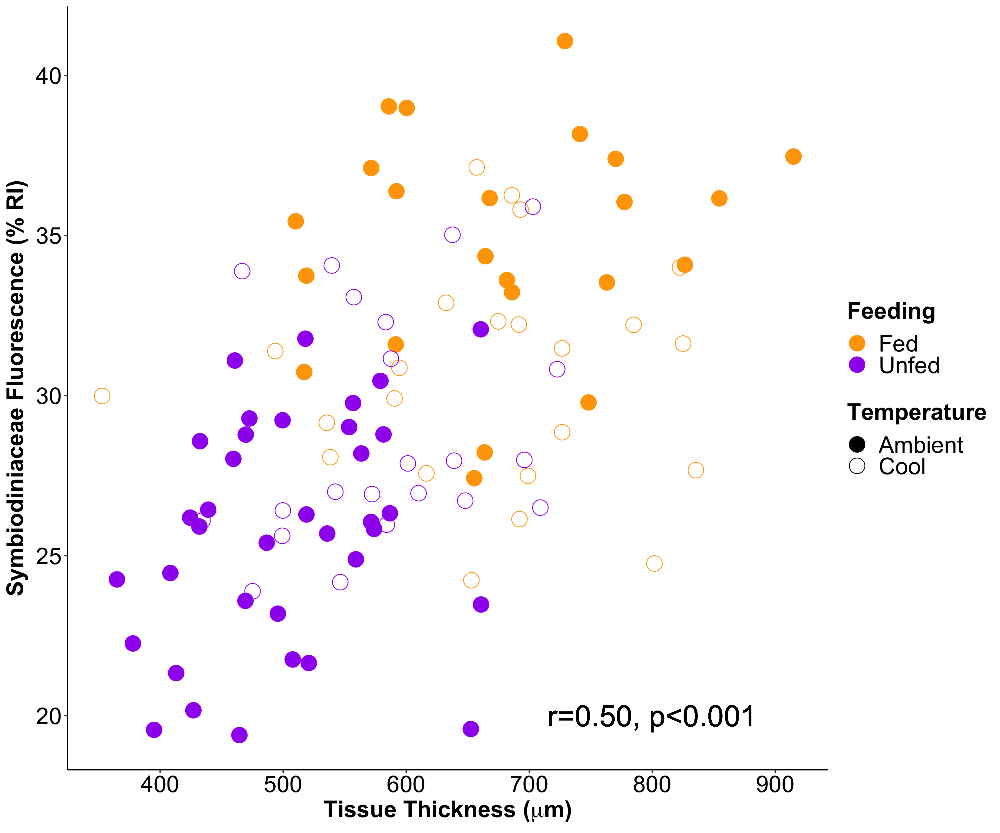

## Setup   

Set up workspace, set options, and load required packages.  
```{r, echo=TRUE, show=FALSE}
rm(list=ls(all=TRUE)) 
```

```{r setup, echo=TRUE}
knitr::opts_chunk$set(root.dir = "~/R",warning=FALSE, message=FALSE)
```

```{r, echo=FALSE, results=FALSE, message=FALSE, warning=FALSE}
library("plotrix") #functions in tapply
library("ggplot2") #plotting
library("reshape2") #reshape data
library("dplyr")  #splitting, applying, and combining data
library("plyr")  #splitting, applying, and combining data
library("pscl") 
library("plotrix") #plotting
library("car") #levenes test and stats package
library("lsmeans") #post hoc tests
library("vegan") #nmds
library("effects") #model effects
library("blmeco") #overdispersion tests
library("multcomp") 
library("multcompView")
library("survival") #Kaplan-Meier Survivorship Curves
library("survminer")  #Kaplan-Meier Survivorship Curves
library("scales")
library("MuMIn")
library("lme4") #linear mixed modeling
library("lmerTest") #Adds p-value calculations to lme4 models
library("MASS")
library("emmeans") #post-hoc tests
library("cowplot") #plotting
library("magick") #plotting images with plots
library("tidyverse")
library("factoextra")
library("ggfortify")
```

## Authors    

Author contributions: A Huffmyer designed study, conducted experiment, collected and analyzed data, and wrote manuscript. C Johnson conducted the experiment and collected data. A Epps collected and analyzed data. R Gates and J Lemus assisted with designing the study and provided laboratory space, resources, and funding. R Gates and J Lemus are joint senior authors.   

## Study overview  

*Methodology overview*  

Juvenile corals were exposed to rearing treatment conditions for 30 days in Ambient and Cool treatments and then exposed to a high temperature simulated stress. Ambient conditions were selected based on average temperatures in summer (June) in Kaneoehe Bay during the timeframe in which this experiment was conducted. The Cool treatment conditions was selected based on average temperatures in spring (March) in Kaneohe Bay. Within these treatments, juveniles were either supplied with fresh plankton from Kaneohe Bay (fed) or were not supplied with this food source (unfed). Three tank replicates were in each treatment: **Ambient-Fed, Ambient-Unfed, Cool-Fed, and Cool-Unfed**. Tanks were 40L in volume and were equipped with a heater, pump, and Ecotech Marine LED aquarium lighting, peaking at ~250 PAR on a 12:12 light:dark cycle. Juveniles were settled and reared in these treatments for 30 days. Over the course of the rearing period, we measured survivorship and growth and measured physiological parameters (tissue thickness and Symbiodiniaceae fluorescence) at the end of the rearing period.We then exposed juvenile corals of each rearing temperature, continuing their respective nutrition treatment, to a one-month stress period at either ambient or high temperature and measured survivorship as a measure of thermal tolerance.    

*See manuscript for detailed methodology and treatment information*  

## 1. Temperature treatments  

Here, we display figures of treatment temperatures and provide descriptive statistics to compare these treatment values to temperature in Kaneohe Bay.  

### *Temperature in Kaneohe Bay*  

Temperature collected from:  

NOAA Moku o Loe station #51207, Pacific Islands Ocean Observing System  
Retrieved from: https://www.ndbc.noaa.gov/station_page.php?station=mokh1   

First, examine NOAA temperature data collected from the Moku o Loe station in March 2017 and June 2017 for comparison to treatment conditions during rearing period. March provides a comparison to the "cool" treatment, while June offers a comparison to the "ambient" treatment.     

Display descriptive statistics of March and June 2017. 
  
```{r, results=TRUE, message=FALSE, warning=FALSE}
noaaJune<-read.csv("Data/NOAA_June17.csv", header=T, na.strings="NA") #load data
noaaMarch<-read.csv("Data/NOAA_March17.csv", header=T, na.strings="NA") #load data 

noaaJune$DD<-as.factor(noaaJune$DD) #set day as factor
noaaMarch$DD<-as.factor(noaaMarch$DD) #set day as factor

TempsMarch <- plyr::ddply(noaaMarch, c("DD"), summarise, #summarize march data
                   Marchmean = mean(WTMP, na.rm=TRUE),
                   Marchsd   = sd(WTMP, na.rm=TRUE),
                   Marchmin = min(WTMP, na.rm=TRUE),
                   Marchmax = max(WTMP, na.rm=TRUE),
                   Marchrange = Marchmax-Marchmin
                   )
TempsMarch%>%
       summarise(Marchmean_temp=mean(Marchmean), Marchmax_temp=max(Marchmean), Marchmin_temp=min(Marchmean), Marchmean_range=mean(Marchrange), Marchmax_range=max(Marchrange), Marchmin_range=min(Marchrange), MarchSD=mean(Marchsd)) #present summary of march data 


TempsJune <- plyr::ddply(noaaJune, c("DD"), summarise, #summarize june data
                   Junemean = mean(WTMP, na.rm=TRUE),
                   Junesd   = sd(WTMP, na.rm=TRUE),
                   Junemin = min(WTMP, na.rm=TRUE),
                   Junemax = max(WTMP, na.rm=TRUE),
                   Junerange = Junemax-Junemin
                   )
TempsJune%>%
       summarise(Junemean_temp=mean(Junemean), Junemax_temp=max(Junemean), Junemin_temp=min(Junemean), Junemean_range=mean(Junerange), Junemax_range=max(Junerange), Junemin_range=min(Junerange), JuneSD=mean(Junesd)) #present summary of june data 

```

### *Temperature in experimental conditions*  

Temperature treatments were controlled using the Apex Neptune Aquacontroller platform in a 12-tank indoor controlled mesocosm system. Data are recorded in the Apex Aquacontroller system every 15 minutes and Apex temperature probes are calibrated every 3-7 days with a digital thermometer. Temperature data are loaded, summarized, and displayed in the figures below as a time series and 24-hour temperature cycles.  

Load temperature data from temperature logger files and generate figure with: 

1. Time series of temperature data with mean treatment temperatures specified by color. 
2. 24-hour cycle of temperatures by summarizing the mean temp at each 15-minute interval per day during the rearing period and the stress period. 

Plot 24-hour cycle of temperatures by summarizing the mean temp at each time of day for during the stress period. This includes only high temperature days, not ramping days.  

```{r, results=TRUE, message=FALSE, warning=FALSE}
physical<-read.csv("Data/Temperature.csv", header=T, na.strings="NA")
physical$DateTime <- as.POSIXct(physical$DateTime, format="%m/%d/%y %H:%M")

#subset temperature measurements
temps<-physical[complete.cases(physical$Temperature), ]

Temps1 <- ddply(temps, c("DateTime", "Treatment"), summarise,
                   N    = length(Temperature[!is.na(Temperature)]),
                   mean = mean(Temperature, na.rm=TRUE),
                   sd   = sd(Temperature, na.rm=TRUE),
                   se   = sd / sqrt(6), 
                   max = max(Temperature, na.rm=TRUE),
                   lower = mean-se, 
                   upper = mean+se
                   )

#set color palette
cols <- c("Ambient" = "#606060","Cool" = "#0099FF","High" = "#FF3333")

TimeSeries<-ggplot(Temps1, aes(x = DateTime, y = mean, fill=Treatment, color=Treatment)) + 
  geom_line(aes(color = Treatment), size = .5) +
  scale_color_manual(values = cols, breaks=c("Cool", "Ambient", "High")) +
  scale_fill_manual(values = cols, breaks=c("Cool", "Ambient", "High")) +
  ylab("Temperature (°C)")+
  xlab("Date")+
  geom_ribbon(aes(ymin=Temps1$lower, ymax=Temps1$upper), linetype=2, alpha=0.4, color=NA) +
  geom_vline(xintercept=as.numeric(Temps1$DateTime[6200]), linetype="dashed", 
                color = "black", size=0.75) +
  geom_vline(xintercept=as.numeric(Temps1$DateTime[12004]), linetype="dotted", 
                color = "black", size=0.75) +
  theme_classic()+
  theme(text = element_text(size = 18, color="black"))+
  theme(axis.title = element_text(size=16, color="black", face="bold")) +
  theme(axis.text.x = element_text())+
  theme(legend.title = element_text(face="bold"))+
  theme(plot.margin = unit(c(0.1, 0.1, 0.1, 0.1), "cm")) + #t, r, b, l
  theme(axis.title.y = element_text(margin = margin(t = 0, r = 5, b = 0, l = 0))) +
  theme(axis.title.x = element_text(margin = margin(t = 5, r = 0, b = 0, l = 0))) +
  theme(legend.position="top")+
  theme(axis.text = element_text(size=16, color="black"))

rearingtemps<-subset(temps, Phase=="Rearing", c(DateTime, Day, Phase, Minutes, Tank, Temperature, Treatment))

Rearing1 <- ddply(rearingtemps, c("Minutes", "Treatment"), summarise,
                   N    = length(Temperature[!is.na(Temperature)]),
                   mean = mean(Temperature, na.rm=TRUE),
                   sd   = sd(Temperature, na.rm=TRUE),
                   se   = sd / sqrt(6), 
                   max = max(Temperature, na.rm=TRUE),
                   min = min(Temperature, na.rm=TRUE), 
                   lower = mean-se, 
                   upper = mean+se
                   )

rearing_sum <- ddply(Rearing1, c("Treatment"), summarise,
                    mean_temp = mean(mean, na.rm=TRUE), 
                    sd_temp   = mean(sd, na.rm=TRUE),
                    min_temp = min(mean),
                    max_temp = max(mean),
                    range_temp = (max_temp-min_temp)
                   )

RearingDay<-ggplot(Rearing1, aes(x = Minutes, y = mean, color=Treatment, fill=Treatment)) + 
  geom_line(aes(color = Treatment), size = .5) +
  scale_color_manual(values = c("#606060", "#0099FF")) +
  scale_fill_manual(values = c("#606060", "#0099FF")) +
  theme_classic() +
  geom_ribbon(aes(ymin=Rearing1$lower, ymax=Rearing1$upper), linetype=2, alpha=0.4, color=NA) +
  ylab("Temperature (°C)")+
  scale_x_continuous(breaks=c(0, 720, 1440), labels=c("0:00", "12:00", "24:00")) +
  xlab("Time of Day") +
  ylim(24.5,31.5)+
  theme(legend.position="none")+
  theme(legend.title = element_text(face="bold"))+
  theme(text = element_text(size = 16, color="black"))+
  theme(plot.margin = unit(c(1, 0.1, 0.1, 1), "cm")) + #t, r, b, l
  theme(axis.title = element_text(size = 16, color="black", face="bold"))+
  theme(axis.title.y = element_text(margin = margin(t = 0, r = 5, b = 0, l = 0))) +
  theme(axis.title.x = element_text(margin = margin(t = 5, r = 0, b = 0, l = 0))) +
  theme(axis.text = element_text(size=16, color="black"))


stresstemps<-subset(temps, Phase=="Stress", c(DateTime, Day, Phase, Minutes, Tank, Temperature, Treatment))
substress1 <- filter(stresstemps, DateTime > as.POSIXct("2017-07-15 09:00:00"))
substress2 <- filter(substress1, DateTime < as.POSIXct("2017-07-20 10:00:00"))
substress3 <- filter(stresstemps, DateTime > as.POSIXct("2017-07-29 12:00:00"))
stresssubset<-bind_rows(substress1, substress2, substress3)

Stress1 <- ddply(stresssubset, c("Minutes", "Treatment"), summarise,
                   N    = length(Temperature[!is.na(Temperature)]),
                   mean = mean(Temperature, na.rm=TRUE),
                   sd   = sd(Temperature, na.rm=TRUE),
                   se   = sd / sqrt(6), 
                   max = max(Temperature, na.rm=TRUE),
                   lower = mean-se, 
                   upper = mean+se
                   )

stress_sum <- ddply(Stress1, c("Treatment"), summarise,
                    mean_temp = mean(mean, na.rm=TRUE), 
                    sd_temp   = mean(sd, na.rm=TRUE),
                    min_temp = min(mean),
                    max_temp = max(mean),
                    range_temp = (max_temp-min_temp)
                   )

#subset to display high values, including both the first and second high temperature period, not ramping days

StressDay<-ggplot(Stress1, aes(x = Minutes, y = mean, color=Treatment, fill=Treatment)) + 
  geom_line(aes(color = Treatment), size = .5) +
  scale_color_manual(values = c("#606060", "#FF3333")) +
  scale_fill_manual(values = c("#606060", "#FF3333")) +
  theme_classic() +
  geom_ribbon(aes(ymin=Stress1$lower, ymax=Stress1$upper), linetype=2, alpha=0.4, color=NA) +
  ylab("Temperature (°C)")+
  xlab("Time of Day") +
  ylim(24.5,31.5)+
  scale_x_continuous(breaks=c(0, 720, 1440), labels=c("0:00", "12:00", "24:00")) +
  theme(legend.position="none")+
  theme(legend.title = element_text(face="bold"))+
  theme(text = element_text(size = 16, color="black"))+
  theme(axis.title = element_text(size = 16, color="black", face="bold"))+
  theme(plot.margin = unit(c(1, 0.1, 0.1, 1), "cm")) + #t, r, b, l
  theme(axis.title.y = element_text(margin = margin(t = 0, r = 5, b = 0, l = 0))) +
  theme(axis.title.x = element_text(margin = margin(t = 5, r = 0, b = 0, l = 0))) +
  theme(axis.text = element_text(size=16, color="black"))

right_row <- plot_grid(RearingDay, StressDay, labels = c('B', 'C'), nrow=2, ncol=1, label_size = 20)
tempplots<-plot_grid(TimeSeries, right_row, labels = c("A", ""), ncol=2, nrow=1, rel_widths = c(2.6, 1), label_size = 20)

ggsave(filename="Figures/TemperatureFigure.pdf", plot=tempplots, dpi=300, width=13, height=6, units="in")
```

  

Display descriptive statistics for rearing treatments.   

```{r, results=TRUE}
rearing_sum
```

Display descriptive statistics for stress treatments.   

```{r, results=TRUE}
stress_sum
```


As the thermal stress profile occured in a dual-stress event due to an interruption in the experimental system, we calculate heat accumlated by the end of the stress test. Heat accumulation was calculated as degree heating days.  

Accumulated stress was calculated by finding the difference between the mean ambient treatment and the daily mean temperature in the high treatment for each day of the stress period. These values are then added over the course of the stress test to provide a total heat accumulation value.  

Heat accumulation was 62.14 in the high treatment as compared to the mean of the *ambient treatment* over the course of the 31-day stress period. Display mean and sd and mean range of temperature treatments during the stress period.  
```{r, results=TRUE}
#summarize temperature to generate means by day
DHD <- ddply(stresstemps, c("Day", "Treatment"), summarise,
                   mean = mean(Temperature, na.rm=TRUE),
                    sd = sd(Temperature, na.rm=TRUE),
                    min = min(Temperature, na.rm=TRUE), 
                    max = max(Temperature, na.rm=TRUE), 
                    range = max-min
                   )

#Obtain mean value for ambient over the course of the entire period
ambientmean<-ddply(stresstemps, c("Treatment"), summarise,
                   mean = mean(Temperature, na.rm=TRUE)
                   )
#Ambient mean over course of stress test is 27.40

#Generate new column to calculate difference between high temperature treatment each day and the average ambient temperature (27.40)
DHD<-subset(DHD, Treatment=="High", c(Day, Treatment, mean))
DHD$Diff<-DHD$mean-27.40

#sum these differences to calculate the total DHD value
sum(DHD$Diff)

#total DHD value is 62.14 Degree Heating Days as compared to mean of ambient treatment
```


## 2. Larval settlement  

Settlement trials were conducted to measure settlement rate in Ambient and Cool temperature treatments to check assumption that starting juveniles were approximatley equal in each temperature. Settlement data is recorded as "Successes", which indicates the number of settlers after 24 hours, and "Failures", which indicates the number of swimming larvae that did not settle. Cohort indicates the day larvae were released from the parent colony. Settlement data are loaded and examined using binomial mixed models.    

```{r, restults=FALSE}
settle<-read.csv("Data/Larval_Settlement.csv", header=T, na.strings="NA")
settle$Cohort<-as.factor(settle$Cohort)
settle$Tank<-as.factor(settle$Tank)

#create binomial vector
attach(settle)
y<-cbind(Success, Failure)
```

Analyze effect of temperature treatment on settlement success with plug nested within tank and cohort as random effects. Cohort indicates day larvae were released over the 4-day collection period.  

`setmod<-glmer(y~Treatment + (1|Tank/Plug.ID) + (1|Cohort), family=binomial)`

Determine significance of treatment using Type II Anova analysis. Display ANOVA table.  

```{r, results=TRUE}
#mixed model with tank and cohort as random effects
setmod<-glmer(y~Treatment + (1|Tank/Plug.ID) + (1|Cohort), family=binomial, REML=F)
Anova(setmod, type="II") #non sign at p=0.5719
```

Results indicate that temperature was not a significant driver of settlement at p=0.5691. Generate summary of model and check assumptions of residual normality.   

```{r, results=TRUE}
setmod<-glmer(y~Treatment + (1|Tank/Plug.ID) + (1|Cohort), family=binomial)
summary(setmod) 
qqPlot(residuals(setmod, type="deviance"))
```

Residuals appear normal. There is no evidence of overdispersion using the blmeco package: `dispersion_glmer(setmod)`    
```{r, results=TRUE}
dispersion_glmer(setmod)
```

There is no effect of treatment on settlement rates. Cohort will remain a random effect in future measurements as it accounted for variation in this model.   

Generate summary of settlement in each temperature treatment.  
```{r, results=TRUE}
settle$prop<-settle$Success/settle$Larvae

Settlement <- ddply(settle, c("Treatment"), summarise,
                   N    = length(prop[!is.na(prop)]),
                   mean = mean(prop, na.rm=TRUE),
                   sd   = sd(prop, na.rm=TRUE),
                   se   = sd / sqrt(N), 
                   max = max(prop, na.rm=TRUE)
)
knitr::kable(Settlement)
```

*Conclusions*  
1. Temperature did not influence settlement rate of larvae during 24-hour period in which settlement took place.  
2. We can assume settlement rate and therefore total number of starting settlers was not different per plug across temperature treatments.   


## 3. Post-settlement survivorship during rearing period  

Survivorship was recorded weekly on all juvenile plugs in the experiment (n = ~715 plugs) as either 0 (at least one living spat) or 1 (no living spat) as required for analyses across multiple timepoints during the 30-day rearing treatment period. Data are examined as survivorship curves and analyzed using Cox Proportional Hazards models with temperature and nutrition as main effects.  

```{r, results=FALSE}
#load data
KM<-read.csv("Data/Rearing_Survivorship.csv", header=TRUE, sep=",", na.strings="NA") #load data

print(levels(KM$Temperature))  ##Levels are ambient, then cool - which is correct
print(levels(KM$Nutrition)) ##Needs to be reordered with No Heterotrophy first

#change variable names to reflect "fed" and "unfed"  
KM$Nutrition<-plyr::revalue(KM$Nutrition, c("Heterotrophy"="Fed", "No Heterotrophy"="Unfed"))
print(levels(KM$Nutrition))

#set reference level
KM$Nutrition <- relevel(KM$Nutrition, ref = "Unfed")
print(levels(KM$Nutrition))
```
 
Survivorship data is analyzed using a Cox Proportional Hazards model:  

`cox1<-coxph(Surv(Days,Censor)~Nutrition*Temperature, data=KM)`  

```{r, results=TRUE}
#survivorship models
#temperature and nutrition as fixed effects
cox1<-coxph(Surv(Days,Censor)~Nutrition + Temperature + Nutrition:Temperature, data=KM)
```

p values are calcuated with a Type II ANOVA. Tests show a significnat effect of temperature on survivorship with a coef of 0.82979 in the cool treatment, indicating that the risk of mortality is approx. 17% lower in cool temperature as compared to ambient.  

Display model summary and ANOVA table.  

```{r, results=TRUE}
summary(cox1)
anova(cox1, type=2)
```

As there is no significant effect of nutritional treatment or an interaction between temperature and nutrition in the hazards model, we display the survivorship curves separated by Temperature and Nutritional treatment separately. The curves show the separation in survivorship by temperature treatment and the lack of difference by nutritional treatment. Note that the difference in survivorship is small (approx 5%), but significant as indicated by model above.  

```{r, results=FALSE, fig.show="hide", results="hide"}
#Fit survivorship function for temperature
fitKM3 <- survfit(Surv(Days, Censor) ~ Temperature, type = "kaplan-meier", conf.type="log", data = KM)

#plot survivorship curves for temperature
survplotKM3<- ggsurvplot(fitKM3, conf.int=TRUE,  pval = FALSE, pval.size=8, test.for.trend = FALSE, main = "Bulk Plugs Survivorship", xlab = "Time (Days)", ylab = "Survival Probability", palette = c("#A0A0A0", "#0099FF"), title="", legend="top", legend.title=" ", surv.scale="percent", font.x=c(20,"bold"), font.tickslab=c(20), font.y=c(20,"bold"), font.title=c(20,"bold"), ylim=c(0,1), font.legend=c(20), font.axis=c(20), legend.lab=c("Ambient", "Cool"))

survplotKM3$plot <- survplotKM3$plot+ 
              ggplot2::annotate("text", 
                                x = 15, y = .35, # x and y coordinates of the text
                                label = "p(Temperature)<0.001", size = 7)

splots<-list()
splots[[1]]<-survplotKM3
surv1<-arrange_ggsurvplots(splots, print=TRUE, ncol=1, nrow=1)
#ggsave(filename="Figures/surv1.png", plot=surv1, dpi=300, width=8, height=8, units="in")
```

```{r, results=FALSE, fig.show="hide", results="hide"}
# fit survivorship function for nutrition
fitKM4 <- survfit(Surv(Days, Censor) ~ Nutrition, type = "kaplan-meier", conf.type="log", data = KM, na.action=na.omit)

#plot survivorship curves for nutrition
survplotKM4<- ggsurvplot(fitKM4, conf.int=TRUE,  pval = FALSE, pval.size=8, test.for.trend = FALSE, xlab = "Time (Days)", ylab = "Survival Probability", palette = c("orange", "purple"), title="", legend="top", legend.title=" ", surv.scale="percent", font.x=c(20,"bold"), font.tickslab=c(20), font.y=c(20,"bold"), font.title=c(20,"bold"), ylim=c(0,1), font.legend=c(20), font.axis=c(20), legend.lab=c("Fed", "Unfed"), margin=c(0.1,0.1,1,0.1))

survplotKM4$plot <- survplotKM4$plot+ 
              ggplot2::annotate("text", 
                                x = 15, y = .35, # x and y coordinates of the text
                                label = "p(Nutrition)=0.47", size = 7, color="darkgray")+
              ggplot2::annotate("text", 
                                x = 15, y = .25, # x and y coordinates of the text
                                label = "p(Nutrition x Temperature)=0.09", size = 7, color="darkgray")
survplotKM4

splots<-list()
splots[[1]]<-survplotKM4
surv2<-arrange_ggsurvplots(splots, print=TRUE, ncol=1, nrow=1)
#ggsave(filename="Figures/surv2.png", plot=surv2, dpi=300, width=8, height=8, units="in")
```

```{r, results=FALSE, fig.show="hide", results="hide"}
splots<-list()
splots[[1]]<-survplotKM3
splots[[2]]<-survplotKM4
survplotsALL<-arrange_ggsurvplots(splots, print=TRUE, ncol=2, nrow=1)
ggsave(filename="Figures/RearingSurvivalFigure.png", plot=survplotsALL, dpi=300, width=13, height=8, units="in")

detach("package:survminer", unload=TRUE)
```

  

Summary of survivorship in table below for each rearing temperature and nutrition treatment at each timepoint.   

```{r, results=TRUE}
SurvSummary2 <- ddply(KM, c("Days","Temperature", "Nutrition"), summarise,
                N    = length(Survivorship[!is.na(Survivorship)]),
                mean = mean(Survivorship, na.rm=TRUE),
                sd   = sd(Survivorship, na.rm=TRUE),
                se   = sd / sqrt(N)
)
knitr::kable(SurvSummary2)
```


*Conclusions*  
1. Survivorship was not different by rearing nutritional treatment or the interaction of nutrition or temperature.  
2. Survivorship was significantly higher in the rearing cool temperature treatment, but to a marginal degree.    


## 4. Growth during rearing period   

Growth data is collected as planar surface area of each juvenile at the start and end of the rearing period (30 days).  

Data was collected and analyzed by C. Johnson and A. Epps from photographs taken of 10-15 plugs from each tank, taken with a scale bar for size reference. Data analyzed in ImageJ/Fiji software.  

Growth rate is calculated as the change in planar surface area normalized to starting size per day (% growth per day).   

Data set is loaded and we remove any individuals with "NA" at the final timepoint due to mortality. As many individuals in this study either started as fused aggregates with other juveniles or fused with multiple other colonies during the rearing period, we will analyze only the individuals Future work should investigate growth, survivorship, and physiology of fused juvenile colonies.  

As growth is measured by photographs, this is the only dataset in which we can verify fusion status. Confocal data was collected on randomly selected plugs, which did not have photograph records from the start of the experiment to determine colony origin as fused or individual.   

```{r, results=FALSE}
#load data
growth<-read.csv("Data/Colony_Growth.csv", header=TRUE, sep=",", na.strings="NA")
growth$Tank<-as.factor(growth$Tank)
growth$Colony.ID<-as.factor(growth$Colony.ID)
growth$Cohort<-as.factor(growth$Cohort)

print(levels(growth$Temperature))  ##Levels are ambient, then cool - which is correct

#change variable names to reflect "fed" and "unfed"  
growth$Nutrition<-plyr::revalue(growth$Nutrition, c("Heterotrophy"="Fed", "No Heterotrophy"="Unfed"))
print(levels(growth$Nutrition))

#set reference level
growth$Nutrition <- relevel(growth$Nutrition, ref = "Unfed")
print(levels(growth$Nutrition))

#check for incomplete rows
r<-which(is.na(growth$Area.Final), arr.ind=TRUE)
growth <- growth[-r, ]

#subset by those that are not fused (inidividuals)
growth_ind<-subset(growth, Fused.Initial=="Not Fused")
growth_ind<-droplevels(growth_ind) #drop unused levels
```

First, calculate % growth per day in planar surface area for each juvenile and check data for normality.   

```{r, results=FALSE}
growth_ind$Planar<-((growth_ind$Area.Final-growth_ind$Area.Initial)/growth_ind$Area.Initial)/(growth_ind$Days)
qqPlot(growth_ind$Planar)
```

Data is non-normally distributed, so we conduct a transformation. A quarter root transformation assists in meeting normality assumptions. We also check normality of model residuals below during model analysis    

```{r, results=TRUE}
growth_ind$tPlanar<-(growth_ind$Planar)^(1/4)
qqPlot(growth_ind$tPlanar)
```

Growth rate is analyzed using lmer mixed effects model.  
Fixed Effects: Nutrition and temperature  
Random Effects: Tank, cohort 

Significance determined using Type II ANOVA function.  

`modelGrowth=lmer(tPlanar~Nutrition * Temperature + (1|Tank/Plug) + (1|Cohort), data=growth_ind)`

```{r, results=TRUE}
modelGrowth=lmer(scale(tPlanar)~Nutrition * Temperature + (1|Tank/Plug.ID) + (1|Cohort), data=growth_ind)
```

Check for homogeneity of variance using the Levene's test (passes) in the car package and normality of residuals. Residuals are approximately normal, but with some very slight deviance at tails of qqPlot.  

```{r, results=TRUE}
leveneTest(growth_ind$tPlanar~growth_ind$Nutrition*growth_ind$Temperature)
qqPlot(residuals(modelGrowth))
```

Display summary of model and anova table for use of p-values. Model summary conducted with scaled data to produce standardized beta weights.   

```{r, results=TRUE}
summary(modelGrowth)
anova(modelGrowth, type=2)
```

Generate a plot of non-transformed data to view percent growth between treatment groups. Display a summary table of proportion growth per day for each treatment.   

```{r, results=TRUE}
#multiply by 100 to obtain percentages for display
growth_ind$graph<-growth_ind$Planar*100

GrowthPlanar <- ddply(growth_ind, c("Nutrition", "Temperature"), summarise,
                   N    = length(graph[!is.na(graph)]),
                   mean = mean(graph, na.rm=TRUE),
                   sd   = sd(graph, na.rm=TRUE),
                   se   = sd / sqrt(N), 
                   max = max(graph, na.rm=TRUE)
)
knitr::kable(GrowthPlanar)
```

Display figure of juvenile growth rate during rearing period.  

```{r, results=TRUE}
Growth1a<-ggplot(data=GrowthPlanar, aes(x=Temperature, y=mean, colour=Nutrition)) +
  scale_colour_manual(values=c("purple", "orange"))+
  geom_line(position=position_dodge(0.03), size=1.3, aes(group=Nutrition)) +
  geom_point(size=3, position=position_dodge(0.03)) +
  geom_errorbar(aes(ymin=mean-se, ymax=mean+se), width=0, linetype="solid", position=position_dodge(0.03), size=1.3) +
  theme_classic()+
  theme(text = element_text(size = 18, color="black"))+
  theme(axis.text = element_text(size = 18, color="black"))+
  theme(legend.position = "none")+
  theme(axis.title = element_text(size = 18, color="black", face="bold"))+
  ylab(expression(bold(paste("% Planar Extension", " Day" ^-1)))) +
  theme(legend.title=element_blank())+
  theme(legend.text = element_text(size=18))+
  theme(plot.margin=unit(c(1.5,0,0,0), "cm"))+
  ylim(0,5)+
  scale_x_discrete(limits=c("Cool", "Ambient"))+
  theme(axis.title.y = element_text(margin = margin(t = 0, r = 7, b = 0, l = 1))) +
  theme(axis.title.x = element_text(margin = margin(t = 7, r = 0, b = 0, l = 0))) +
  xlab("Temperature") +
  geom_text(x=1.5, y=0.9, label="p(Nutrition)=0.03", size=6, color="black") + 
  geom_text(x=1.5, y=0.6, label="p(Temperature)=0.82", size=6, color="darkgray") + 
  geom_text(x=1.5, y=0.3, label="p(Interaction)=0.59", size=6, color="darkgray")

growthfig<-plot_grid(Growth1a, labels = c(""), ncol=1, nrow=1, rel_heights= c(1), rel_widths = c(1), label_size = 20, label_y=1, align="h")

ggsave("Figures/Growth_Figure.pdf", plot=growthfig, height=8, width=10, units = c("in"), dpi=500) #output figure
```

 

*Conclusions*  
1. Growth was significantly higher in heterotrophic feeding treatment during rearing period. 

2. There was no effect of rearing temperature on growth.    


## 5. Confocal Measurements: Data Manipulation  

Tissue thickness and symbiont densities are measured using Laser Scanning Confocal Microscopy as described in Huffmyer et al. (2020). Data were collected at the end of the rearing period.    

Raw data sets are inputted and manipulated to calculate the following based on the average intensity of Channel 2 (Red) = symbiont fluorescence intensity per juvenile 

```{r, results=FALSE}
#load data set for fluorescence (symbionts)
fluorescence<-read.csv("Data/Symbiont_Fluorescence.csv", header=TRUE, sep=",", na.strings="NA")

#load data set for tissue thickness 
zstack<-read.csv("Data/Tissue_Thickness.csv", header=TRUE, sep=",", na.strings="NA")

#load data set for colony area
area<-read.csv("Data/Colony_Area.csv", header=TRUE, sep=",", na.strings="NA")

#calculate average intensity values for symbionts
glow <- aggregate(fluorescence$Symbiont.Intensity, by=list(fluorescence$Sample, fluorescence$Tissue), FUN=mean)
glow <- rename(glow, c("Group.1"="Sample", "Group.2"="Tissue","x"="Symbiont.Intensity"))

#calculate average tissue intensity values and merge into glow datasheet
glow2 <- aggregate(fluorescence$Tissue.Intensity, by=list(fluorescence$Sample, fluorescence$Tissue), FUN=mean)
glow2 <- rename(glow2, c("Group.1"="Sample", "Group.2"="Tissue","x"="Tissue.Intensity"))

#calculate a colony mean value for symbionts and add into dataset
meanglow<-aggregate(glow$Symbiont.Intensity, by=list(glow$Sample), FUN=mean)
meanglow<-rename(meanglow, c("Group.1"="Sample", "x"="Symbiont.Intensity"))
meanglow$Tissue<-c("Colony")
meanglow$Tissue<-as.factor(meanglow$Tissue)

meanglow2<-aggregate(glow2$Tissue.Intensity, by=list(glow2$Sample), FUN=mean)
meanglow2<-rename(meanglow2, c("Group.1"="Sample", "x"="Tissue.Intensity"))
meanglow2$Tissue<-c("Colony")
meanglow2$Tissue<-as.factor(meanglow2$Tissue)

glow<-rbind.fill(glow, meanglow)
glow2<-rbind.fill(glow2, meanglow2)

#merge together
glow$Tissue.Intensity<-glow2$Tissue.Intensity

#remove incomplete rows
glow<-glow[complete.cases(glow), ]

#summarize average values for tissue thickness 
thickness <- aggregate(zstack$Thickness, by=list(zstack$Sample, zstack$Tissue), FUN=mean)
thickness <-rename(thickness, c("Group.1"="Sample", "Group.2"="Tissue","x"="Thickness"))

#calculate a colony mean value for thickness and add into datasheet
meanz<-aggregate(thickness$Thickness, by=list(thickness$Sample), FUN=mean)
meanz<-rename(meanz, c("Group.1"="Sample", "x"="Thickness"))
meanz$Tissue<-c("Colony")
meanz$Tissue<-as.factor(meanz$Tissue)

thickness<-rbind.fill(thickness, meanz)
#remove incomplete rows
thickness<-thickness[complete.cases(thickness), ]
```

Datasheets are assembled into a master data frame for analysis and includes all identifying information.  

```{r, results=FALSE}

#match thickness and glow by sample and tissue 
#create identifier column
thickness$ID<-paste(thickness$Sample, thickness$Tissue)
glow$ID<-paste(glow$Sample, glow$Tissue)

#merge values into one spreadsheet

thickness$Symbiont.Intensity<-glow$Symbiont.Intensity[match(thickness$ID, glow$ID)]
thickness$Tissue.Intensity<-glow$Tissue.Intensity[match(thickness$ID, glow$ID)]
thickness$Plug<-zstack$Plug[match(thickness$Sample, zstack$Sample)]
thickness$Spat<-zstack$Spat[match(thickness$Sample, zstack$Sample)]
thickness$Polyps<-zstack$Polyps[match(thickness$Sample, zstack$Sample)]
thickness$Cohort<-zstack$Cohort[match(thickness$Sample, zstack$Sample)]
thickness$Temperature<-zstack$Temperature[match(thickness$Sample, zstack$Sample)]
thickness$Nutrition<-zstack$Nutrition[match(thickness$Sample, zstack$Sample)]
thickness$Treatment<-zstack$Treatment[match(thickness$Sample, zstack$Sample)]
thickness$Tank<-zstack$Tank[match(thickness$Sample, zstack$Sample)]

#merge in area for each spat
thickness$Area<-area$Area[match(thickness$Sample, area$Sample)]

#call new data frame by new name and change cohort and tank to factors
confocal<-thickness
confocal$Cohort<-as.factor(confocal$Cohort)
confocal$Tank<-as.factor(confocal$Tank)
```

**Calibrate LSCM fluorescence values as described in Huffmyer et al. 2020:**  

LSCM collects symbiont cell density data as the intensity of "red" chlorophyll fluorescence as specified in LSCM settings. This value can be calibrated to a % Relative Intensity value, by using the Red InSpeck fluorescent microbead kits.  

Calibration equation for juvenile *P. acuta*: (Red Intensity Value + 79.395) / 24.301  

```{r, results=FALSE}
confocal$Red<-(confocal$Symbiont.Intensity+79.395)/24.301
confocal$Ratio<-(confocal$Symbiont.Intensity/confocal$Tissue.Intensity)
confocal$Green<-(confocal$Tissue.Intensity-38.045)/257.71

#remove individual colony with outlier surface area of 22 (about 10 higher than all others)
q <- with(confocal, which(Area>20, arr.ind=TRUE))
confocal <- confocal[-q, ]

#export master data frame
write.csv(confocal, file="Output/Master_Confocal.csv")
```

Subset measurements averaged over the entire colony.   

```{r, results=FALSE}
colony<-subset(confocal, Tissue=="Colony", select=c(Sample, Tissue, Thickness, ID, Symbiont.Intensity, Tissue.Intensity, Plug, Spat, Cohort, Temperature, Nutrition, Treatment, Tank, Area, Red, Green, Ratio))
polyp<-subset(confocal, Tissue=="Polyp", select=c(Sample, Tissue, Thickness, ID, Symbiont.Intensity, Tissue.Intensity, Plug, Spat, Cohort, Temperature, Nutrition, Treatment, Tank, Area, Red, Green, Ratio))
connecting<-subset(confocal, Tissue=="Connecting", select=c(Sample, Tissue, Thickness, ID, Symbiont.Intensity, Tissue.Intensity, Plug, Spat, Cohort, Temperature, Nutrition, Treatment, Tank, Area, Red, Green, Ratio))

#create data frame for all characteristics
colony$PolypThickness<-polyp$Thickness[match(colony$Sample, polyp$Sample)]
colony$PolypRed<-polyp$Red[match(colony$Sample, polyp$Sample)]
colony$ConnectThickness<-connecting$Thickness[match(colony$Sample, polyp$Sample)]
colony$ConnectRed<-connecting$Red[match(colony$Sample, polyp$Sample)]
```


## 6. Confocal Tissue Thickness  

Using the "Master_Confocal" data frame, we first analyze tissue thickness measured by LSCM.    

```{r, results=FALSE}
print(levels(colony$Temperature))  ##Levels are ambient, then cool - which is correct
print(levels(colony$Nutrition)) ##Needs to be reordered with No Heterotrophy first

#change variable names to reflect "fed" and "unfed"  
colony$Nutrition<-plyr::revalue(colony$Nutrition, c("Heterotrophy"="Fed", "No Heterotrophy"="Unfed"))
print(levels(colony$Nutrition))

#set reference level
colony$Nutrition <- relevel(colony$Nutrition, ref = "Unfed")
print(levels(colony$Nutrition))

```

Examine data for normality, using data collected as averaged over each juvenile colony.  

```{r, results=TRUE}
qqPlot(colony$Thickness)
```

Thickness data is normally distributed.  

As data is continuous and normally distributed, we will analyze the data with lmer() as a linear mixed effects model.  

We know that each juvenile differs in its size (planar surface area). First, test whether colony size should be included as a random covariate. Run a linear regression of thickness by colony size.  

```{r, results=TRUE, warning=FALSE, message=FALSE}
summary(lm(Thickness~Area, data=colony))

# Fit regression line
library(stats)
reg<-lm(Thickness ~ Area, data = colony)
coeff=coefficients(reg)
# equation of the line : 
eq = paste0("y = ", round(coeff[2],1), "*x ", round(coeff[1],1))
# plot
plot(colony$Area, colony$Thickness, main=eq)
abline(reg, col="blue")
```

Thickness significantly increases as colony size increases. Therefore, colony size should be included as a random covariate. Below, run model and do an AIC comparison to validate this. 

`thickModel<-lmer(Thickness~Temperature+Nutrition+Temperature:Nutrition + (1+Area|Plug) + (1|Cohort) + (1|Tank/Plug), data=colony)`  

Temperature and Nutrition are main effects. Cohort and plug nested within tank as random effects as multiple individuals were measured on the same plug. Area is incorporated as a random effect to account for differences in colony size.    

Run model, view summary of model, and anova table for use of p-values.  
```{r, results=TRUE, warning=FALSE, message=FALSE}
thickModel<-lmer(scale(Thickness)~Temperature + Nutrition + Temperature:Nutrition + (1+Area|Plug) + (1|Cohort) + (1|Tank/Plug), data=colony) 

summary(thickModel)
anova(thickModel, type=2)
```

Compare a model without colony size as a random effect to compare model fits.  
```{r, results=TRUE, warning=FALSE, message=FALSE}
thickModel2<-lmer(scale(Thickness)~Temperature + Nutrition + Temperature:Nutrition + (1|Cohort) + (1|Tank/Plug), data=colony) 

model.sel(thickModel, thickModel2)
```

The model with area included (thickModel) is the best fitting model by AIC evaluation. Continue with analysis using colony size as a random covariate.  

Check homogeneity of variances assumption with Levene's Test - passes. Check for normality of residuals - passes.  
```{r, results=TRUE}
leveneTest(colony$Thickness~colony$Nutrition*colony$Temperature)
qqPlot(residuals(thickModel))
```

Summarize mean tissue thickness in a table.   

```{r, results=TRUE}
ThickTable <- ddply(colony, c("Nutrition", "Temperature"), summarise,
                   N    = length(Thickness[!is.na(Thickness)]),
                   mean = mean(Thickness, na.rm=TRUE),
                   sd   = sd(Thickness, na.rm=TRUE),
                   se   = sd / sqrt(N), 
                   max = max(Thickness, na.rm=TRUE)
)
knitr::kable(ThickTable)
```

View interaction plot.    
```{r, results=TRUE}
Thick2<-ggplot(data=ThickTable, aes(x=Temperature, y=mean, colour=Nutrition)) +
  scale_colour_manual(values=c("purple", "orange"))+
  geom_line(position=position_dodge(0.03), size=1.3, aes(group=Nutrition)) +
  geom_point(size=3, position=position_dodge(0.03)) +
  geom_errorbar(aes(ymin=mean-se, ymax=mean+se), width=0, linetype="solid", position=position_dodge(0.03), size=1.3) +
  theme_classic()+
  theme(text = element_text(size = 18, color="black"))+
  theme(axis.text.x = element_text(size = 18, color="black"))+
  theme(axis.text = element_text(size = 18, color="black"))+
  theme(legend.position = "none")+
  theme(axis.title = element_text(size = 18, color="black", face="bold"))+
  ylab(expression(bold(paste("Tissue Thickness (", mu, "m)")))) +
  theme(legend.title=element_blank())+
  theme(legend.text = element_text(size=18))+
  theme(plot.margin=unit(c(1.5,0,0,0), "cm"))+
  ylim(300,850) +
  theme(axis.title.y = element_text(margin = margin(t = 0, r = 7, b = 0, l = 1))) +
  theme(axis.title.x = element_text(margin = margin(t = 8, r = 0, b = 0, l = 0))) +
  xlab("Temperature") +
  scale_x_discrete(limits=c("Cool", "Ambient"))+
  geom_text(x=1.5, y=410, label="p(Nutrition)<0.001", size=6, color="black") + 
  geom_text(x=1.5, y=375, label="p(Temperature)=0.06", size=6, color="darkgray") + 
  geom_text(x=1.5, y=340, label="p(Interaction)=0.03", size=6, color="black")

ggsave("Figures/Thickness_Figure.pdf", plot=Thick2, height=8, width=6, units = c("in"), dpi=300) #output figure
```

 

*Conclusions*  

1. There was a significant positive effect of rearing nutrition on tissue thickness.  

2. There was a significant interactive effect of rearing nutrition and temperature, with thicker tissues in heterotrophically fed groups and thicker tissues in cool temperature in the absence of heterotrophy.  


## 7. Confocal fluorescence

Using the confocal data frame we analyze symbiont chlorophyll fluorescence measured by LSCM at the end of the rearing period.  

```{r, results=TRUE}
qqPlot(colony$Red)
```
 
Data for symbiont fluorescence is normal and averaged over each juvenile colony.   
 
As data is continuous and normally distributed, we will analyze the data with lmer() as a linear mixed effects model.  

As done above with tissue thickness, check for an effect of colony size on symbiont fluorescence with a linear regression.  
 
```{r, results=TRUE, warning=FALSE, message=FALSE}
summary(lm(Red~Area, data=colony))

# Fit regression line
library(stats)
reg<-lm(Red ~ Area, data = colony)
coeff=coefficients(reg)
# equation of the line : 
eq = paste0("y = ", round(coeff[2],1), "*x ", round(coeff[1],1))
# plot
plot(colony$Area, colony$Red, main=eq)
abline(reg, col="blue")
```

There is not a significant effect of colony size on symbiont fluorescence, so this will not be included in analysis of symbiont fluorescence.  

Temperature and Nutrition are main effects. Cohort and plug nested within tank as random effects as multiple individuals were measured on the same plug. 

`redModel<-lmer(Red~Temperature+Nutrition+Temperature:Nutrition + (1|Cohort) + (1|Tank/Plug), data=colony)`

View summary of model and anova table for use of p-values.      
```{r, results=TRUE, message=FALSE, warning=FALSE}
RedModel<-lmer(scale(Red)~Temperature+Nutrition+Temperature:Nutrition + (1|Cohort) + (1|Tank/Plug), data=colony)
summary(RedModel)
anova(RedModel, type=2)
```

Test for homogeneity of variances - passes. Test normality of residuals - passes.  
```{r, results=TRUE}
leveneTest(colony$Red~colony$Temperature*colony$Nutrition)
qqPlot(residuals(RedModel))
```

Summarize symbiont fluorescence (mean colony %RI) in a table and plot.   

```{r, results=TRUE}
RedTable <- ddply(colony, c("Nutrition", "Temperature"), summarise,
                   N    = length(Red[!is.na(Red)]),
                   mean = mean(Red, na.rm=TRUE),
                   sd   = sd(Red, na.rm=TRUE),
                   se   = sd / sqrt(N), 
                   max = max(Red, na.rm=TRUE)
)
knitr::kable(RedTable)
```

View interaction plot.  
```{r, results=TRUE}
RedTable$Nutrition <- factor(RedTable$Nutrition, levels = c("Fed", "Unfed"))

Red2<-ggplot(data=RedTable, aes(x=Temperature, y=mean, colour=Nutrition)) +
  scale_colour_manual(values=c("orange", "purple"), labels=c("Fed", "Unfed"))+
  geom_line(position=position_dodge(0.03), size=1.3, aes(group=Nutrition)) +
  geom_point(size=3, position=position_dodge(0.03)) +
  geom_errorbar(aes(ymin=mean-se, ymax=mean+se), width=0, linetype="solid", position=position_dodge(0.03), size=1.3) +
  geom_text(x=1.5, y=21, label="p(Nutrition)<0.001", size=6, color="black") + 
  geom_text(x=1.5, y=19, label="p(Temperature)=0.85", size=6, color="darkgray") + 
  geom_text(x=1.5, y=17, label="p(Interaction)=0.005", size=6, color="black") + 
  theme_classic()+
  ylim(15,45)+
  theme(text = element_text(size = 18, color="black"))+
  theme(legend.text=element_text(size=18))+
  theme(axis.text = element_text(size = 18, color="black"))+
  theme(axis.text.x = element_text(size = 18, color="black"))+
  theme(legend.position="right")+
  scale_x_discrete(limits=c("Cool", "Ambient"))+
  theme(legend.title=element_text(face="bold"))+
  theme(axis.title = element_text(size = 18, color="black", face="bold"))+
  theme(axis.title.y = element_text(margin = margin(t = 0, r = 5, b = 0, l = 0))) +
  theme(axis.title.x = element_text(margin = margin(t = 5, r = 0, b = 0, l = 0))) +
  ylab(expression(bold(paste("Symbiodiniaceae Fluorescence (% RI)")))) +
  xlab("Temperature")

ggsave("Figures/Fluorescence_Figure.pdf", plot=Red2, height=8, width=8, units = c("in"), dpi=300) #output figure
```

  

### **Correlation between thickness and fluorescence**  

Display Pearson correlation results between these two characteristics of physiology. Pearson correlation is used as data are normally distributed.      

```{r, results=TRUE}
cor.test(colony$Red, colony$Thickness, method=c("pearson"))
``` 

Plot relationship between tissue thickness and Symbiodiniaceae fluorescence.  
 
```{r, results=TRUE, warning=FALSE}
colony$Nutrition <- factor(colony$Nutrition, levels = c("Fed", "Unfed"))

Cor1<-ggplot(colony, aes(x=Thickness, y=Red)) + 
  geom_point(aes(color=Nutrition, shape=Temperature), size=6) +
   scale_color_manual(name="Nutrition",
                    values=c("orange", "purple"), 
                    labels=c("Fed", "Unfed"))+
  scale_shape_manual(values = c("circle", "triangle"))+
  theme_classic()+
  geom_text(x=800, y=20, label="r=0.50, p<0.001", size=9, color="black") +
  theme(text = element_text(size = 20))+
  theme(axis.text = element_text(size = 20, color="black"))+
  theme(axis.title = element_text(size = 20, face="bold"))+
  theme(legend.title = element_text(size = 20, face="bold"))+
  theme(legend.text = element_text(size = 20, color="black"))+
  ylab(expression(bold(paste("Symbiodiniaceae Fluorescence (% RI)")))) +
  xlab(expression(bold(paste("Tissue Thickness ("*mu*"m)"))))

ggsave("Figures/Correlation_Physiology_Figure.png", plot=Cor1, height=10, width=12, units = c("in"), dpi=300) #output figure

```

   

Conduct a model analysis to determine whether temperatures have different slopes in the relationship between tissue thickness and symbiont fluorescence.  

```{r, results=TRUE, warning=FALSE, message=FALSE}
colony$Nutrition <- factor(colony$Nutrition, levels = c("Unfed", "Fed"))

corrModel<-lmer(Red~Thickness * Temperature * Nutrition + (1|Tank) + (1|Cohort), data=colony)
summary(corrModel)
anova(corrModel, type=2)
```

There was no interactive effect between thickness and nutrition or temperature, indicating that these conditions did not alter the relationship between thickness and the amount of fluorescence. Rather, differences in these values may be driven by nutrition.   

*Conclusions*  

1. There was a significant positive effect of rearing nutrition on symbiont fluorescence.  

2. There was a significant interactive effect of rearing temperature and nutrition on symbiont fluorescence. In the absence of heterotrophy cool temperature had a trend for higher fluorescence with the opposite trend occuring in the presence of heterotrophy.  

3. There was a positive correlation between tissue thickness and symbiont fluorescence.  

### **Generate assembled figure**  

Generate final figure of physiological response variables and confocal images of juveniles.   
```{r, results=FALSE}
confocalfig1<-plot_grid(Growth1a, Thick2, Red2, labels = c("A", "B", "C"), ncol=3, nrow=1, rel_heights= c(1,1,1), rel_widths = c(1,1,1.5), label_size = 20, label_y=1, align="h")

ggsave(filename="Figures/Physiology_fig1.png", plot=confocalfig1, dpi=500, width=20, height=6, units="in")

photo2 <- cowplot::ggdraw() + cowplot::draw_image("Figures/Juvenile_Photos.jpg", scale = 1)
photo <- cowplot::ggdraw() + cowplot::draw_image("Figures/Physiology_fig1.png", scale = 1)

confocalfinal<-plot_grid(photo, photo2, labels = c(""), ncol=1, nrow=2, rel_heights= c(1,0.8), rel_widths = c(1,1), align="h")

ggsave(filename="Figures/Physiology_Figure.png", plot=confocalfinal, dpi=300, width=10, height=6, units="in")
```


 


## 8. Thermal stress survivorship  

Survivorship was measured as the number of inidividual colonies alive on each plug at the beginning and end of the stress test, which occured for 30 days after the end of the rearing period. 

Load in survivorship data, examine structure, and create binomial vector of Success/Failure.   

```{r, results=TRUE}
thermal<-read.csv("Data/Stress_Survival.csv", header=T)
thermal$Stress.Tank<-as.factor(thermal$Stress.Tank)
thermal$Rear.Tank<-as.factor(thermal$Rear.Tank)
thermal$Cohort<-as.factor(thermal$Cohort)
thermal$Nutrition<-relevel(thermal$Nutrition, ref = "No Heterotrophy")

#calculation of survivorship by proportion
thermal$Surv<-(thermal$Juveniles)/(thermal$Failures+thermal$Juveniles)

final<-thermal[which(thermal$Day == "31"),] #subset final timepoint
```

Analyze with a binomial vector of successes and failures. Successes is the number of living juveniles ("Juveniles") and failure is the number of juveniles that have died from the initial timepoint (Initial juveniles - Juveniles at timepoint) called "Failures".  
 
Summary of total survivorship at the end of the thermal stress test. Display survival as percentages (%).     

```{r, results=TRUE}
Stress.Summary <- ddply(final, c("Stress.Temp", "Rear.Temp", "Nutrition"), summarise,
                        N    = length(Surv[!is.na(Surv)]),
                        mean = mean(Surv, na.rm=TRUE)*100,
                        sd   = sd(Surv, na.rm=TRUE)*100,
                        se   = sd / sqrt(N)
)

knitr::kable(Stress.Summary)
```


```{r, results=FALSE}
#create binomial vector
attach(final)
x<-cbind(Juveniles, Failures)
```

Analyze survivorship at the end of the thermal stress using a binomial mixed effects model.  

Main effects: Rearing temperature, nutrition, and stress temperature  
Random effects: Tank and cohort  

`stressFINALmod<-glmer(x~Stress.Temp*Rear.Temp*Nutrition + (1|Stress.Tank) + (1|Cohort), family=binomial)`

Run model and display summary as well as anova table for use of p-values.   

```{r, results=TRUE}
stressFINALmod<-glmer(x~Stress.Temp*Rear.Temp*Nutrition + (1|Stress.Tank) + (1|Cohort), family=binomial)

summary(stressFINALmod)
Anova(stressFINALmod)
```

Check for evidence of overdispersion - passes.   
```{r, results=TRUE}
dispersion_glmer(stressFINALmod) #no evidence of overdispersion
```

Plot total survivorship in high and ambient treatment at the end of the stress period.  
 
```{r, results=TRUE}
cols <- c("Ambient" = "#606060","Cool" = "#0099FF")
          
FigSurvStress <- ggplot(data=Stress.Summary, aes(x=factor(Stress.Temp), y=mean, group=interaction(Rear.Temp, Nutrition), colour=Rear.Temp, linetype=Nutrition)) + 
  geom_line(position=position_dodge(0.03), size=1.3) +
  geom_point(size=3, position=position_dodge(0.03)) +
  geom_errorbar(aes(ymin=mean-se, ymax=mean+se), width=0, linetype="solid", position=position_dodge(0.03), size=1.3) +
  xlab(expression(bold("Temperature"))) +
  ylab(expression(bold("Survivorship (%)"))) +
  ylim(-10,100) + 
  ggtitle("")+
  theme_classic() +
 #scale_y_continuous(breaks=c(0,0.2,0.4,0.6,0.8,1))+
  scale_colour_manual(name=expression(bold(atop("Rearing         ", paste("Temperature")))),
                        breaks=c("Ambient", "Cool"),
                        labels=c("Ambient (27.4°C)", "Cool (30.1°C)"), 
                        values=cols)+
  scale_linetype_manual(name=expression(bold("Nutrition")),
                          breaks=c("Heterotrophy", "No Heterotrophy"),
                          labels=c("Fed", "Unfed"), 
                          values=c("solid", "dotted")) +
  annotate("text", x = .45, y = 15, 
           label = "p(Stress Temp.)<0.001", size = 5, color="black", hjust=0)+
   annotate("text", x = .45, y = 11, 
           label = "p(Rearing Temp.)<0.001", size = 5, color="black", hjust=0)+
   annotate("text", x = .45, y = 07, 
           label = "p(Nutrition)<0.001", size = 5, color="black", hjust=0)+
   annotate("text", x = .45, y = 03, 
           label = "p(Stress Temp. x Rearing Temp.)=0.66", size = 5, color="darkgray", hjust=0)+
   annotate("text", x = .45, y = -01, 
           label = "p(Stress Temp. x Nutrition)=0.008", size = 5, color="black", hjust=0)+
   annotate("text", x = .45, y = -05, 
           label = "p(Rearing Temp. x Nutrition)=0.004", size = 5, color="black", hjust=0)+
   annotate("text", x = .45, y = -09, 
           label = "p(Three-way Interaction)=0.74", size = 5, color="darkgray", hjust=0)+
  theme(panel.background = element_blank()) +
  theme(text = element_text(size=20),
        panel.border = element_blank(), 
        plot.background =element_blank(),
        panel.grid.major = element_blank(), 
        panel.grid.minor = element_blank(), 
        axis.line = element_line(colour = "black"),
        axis.text = element_text(size=18, colour="black"),
        legend.title=element_text(),
        legend.position=("right"),
        plot.title=element_text(), #Justify the title to the top left
        legend.text = element_text(size = 20),
        axis.title.y=element_text(margin=margin(0,7,0,0)), 
        axis.title.x=element_text(margin=margin(7,0,0,0)))

ggsave(filename="Figures/Stress_Survival_Total.png", plot=FigSurvStress, dpi=300, width=10, height=8, units="in")
```


```{r, results=TRUE}

detach(final)
          
```

*Conclusions*  

1. There was a positive effect of heterotrophic feeding on juvenile survival during high temperature stress.  
2. Juveniles reared at cool temperature with access to heterotrophy had higher survival both at ambient and high temperature conditions.  
 